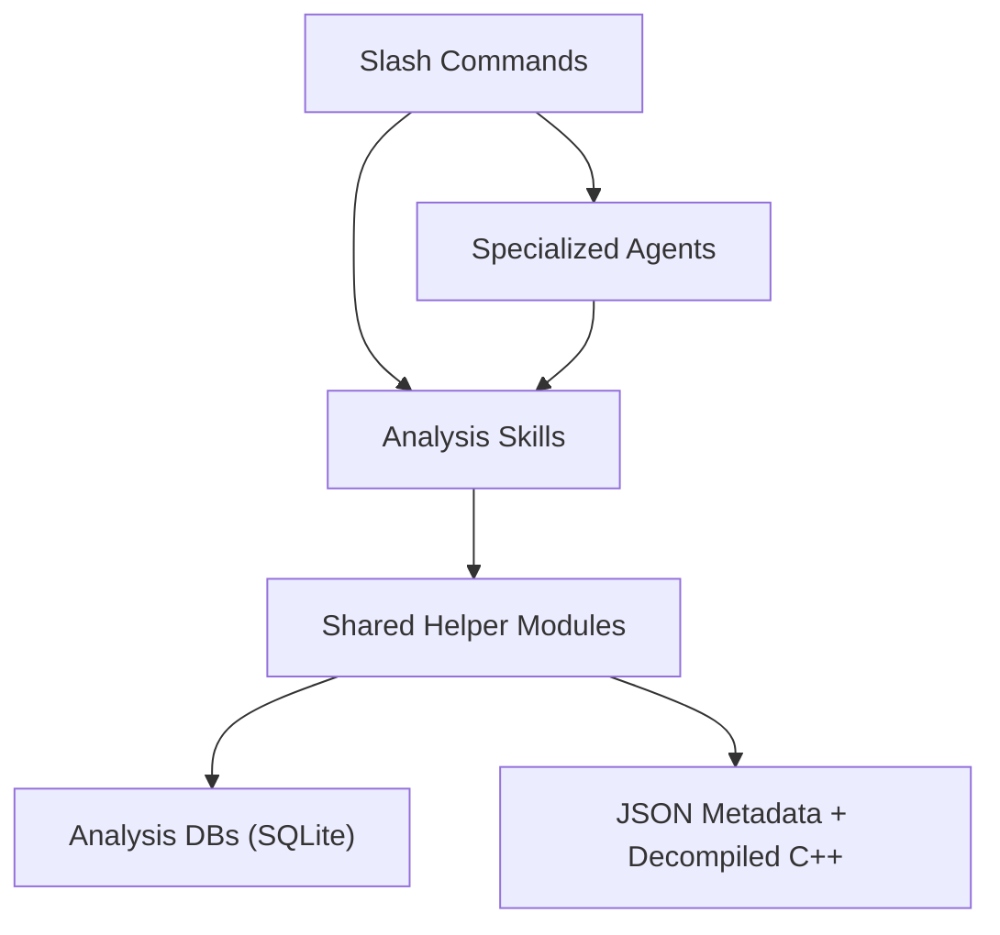

# DeepExtractIDA Agent Analysis Runtime

The Agent Analysis Runtime is the source repository that gets installed as
`.agent/` inside a `DeepExtractIDA_output_root`. It turns DeepExtractIDA's
decompiled C++ files, JSON metadata, and SQLite analysis databases into a
queryable runtime with slash commands, specialized subagents, lifecycle hooks,
and a shared helper library.

> **New here?** Start with the [Onboarding Guide](docs/ONBOARDING.md).

---

## Architecture



Commands are the user-facing workflows. They orchestrate agents and skills.
Skills call the helpers library, and helpers read the extractor outputs
produced by DeepExtractIDA.

---

## Installed Workspace Layout

When this repository is installed into a DeepExtractIDA output root, the
workspace looks like this:

```text
<DeepExtractIDA_output_root>/
  AGENTS.md                  Root instructions for the installed workspace
  CLAUDE.md                  Claude bootstrap instructions, if present
  extraction_report.json     Extractor provenance and status
  logs/                      Extractor and symchk logs
  idb_cache/                 Optional cached IDA databases from extraction
  extracted_code/
    <module>/
      *.cpp
      file_info.json
      function_index.json
      module_profile.json
      reports/
  extracted_dbs/
    analyzed_files.db        Extractor-default tracking DB
    <module>_<hash>.db
  .agent/                    Installed DeepExtractRuntime
    AGENTS.md
    README.md
    commands/
    agents/
    hooks/
    docs/
    helpers/
    skills/
    rules/
    config/
      defaults.json
      assets/                COM, RPC, WinRT, and misc ground-truth data
      pipelines/             YAML pipeline definitions
    cache/
    workspace/
    tests/
  .cursor/                   Cursor IDE integration (created by bootstrap)
    hooks.json               Copy of .agent/hooks.json
    rules/                   Symlink to .agent/rules/
  hooks.json                 Host hook configuration (legacy location)
```

The runtime primarily expects the tracking DB at
`extracted_dbs/analyzed_files.db`. For compatibility with single-file or older
layouts, [`helpers/db_paths.py`](helpers/db_paths.py) also accepts a root-level
`analyzed_files.db`.

In this source checkout, the same runtime content lives at repository root.
When installed, that source tree becomes `.agent/`.

---

## Runtime Inventory

| Component   | Count | Source of Truth                                    |
| ----------- | ----- | -------------------------------------------------- |
| Commands    | 36    | [`commands/registry.json`](commands/registry.json) |
| Agents      | 6     | [`agents/registry.json`](agents/registry.json)     |
| Skills      | 29    | [`skills/registry.json`](skills/registry.json)     |
| Rules       | 8     | [`rules/`](rules/)                                 |
| Hook events | 3     | [`hooks.json`](hooks.json)                         |
| Helpers     | 56    | [`helpers/`](helpers/)                              |
| Docs        | 20    | [`docs/`](docs/)                                   |
| Tests       | 91    | [`tests/`](tests/)                                 |

---

## Agents

The runtime currently ships 6 subagents:

| Agent                | Purpose                                             | Key Scripts                                                                       |
| -------------------- | --------------------------------------------------- | --------------------------------------------------------------------------------- |
| `re-analyst`         | Explain functions, trace call chains, classify code | `re_query.py`, `explain_function.py`                                              |
| `triage-coordinator` | Orchestrate multi-skill module analysis             | `analyze_module.py`, `generate_analysis_plan.py`                                  |
| `security-auditor`   | Run vulnerability scans and finding verification    | `run_security_scan.py`                                                            |
| `type-reconstructor` | Reconstruct structs and classes                     | `reconstruct_all.py`, `merge_evidence.py`, `validate_layout.py`                   |
| `verifier`           | Verify lifted code against assembly ground truth    | `compare_lifted.py`, `extract_basic_blocks.py`, `generate_verification_report.py` |
| `code-lifter`        | Lift related functions with shared state            | `batch_extract.py`, `track_shared_state.py`                                       |

See [agents/README.md](agents/README.md) for the full architecture, file tree,
and decision table.

---

## Commands

The runtime currently ships 36 slash commands under `.agent/commands/`. Common
entry points include:

| Command                              | Purpose                                                                                             |
| ------------------------------------ | --------------------------------------------------------------------------------------------------- |
| `/triage <module> [--with-security]` | Module orientation: identity, classification, call graph, attack surface, optional quick taint pass |
| `/explain [module] <function>`       | Fast structured explanation of a function                                                           |
| `/audit [module] <function>`         | Deep security audit with dossier, verification, call chain, and taint context                       |
| `/scan <module>`                     | Unified memory, logic, and taint vulnerability scan                                                 |
| `/verify-decompiler-batch <module>`  | Batch decompiler verification across a class or function set                                        |
| `/verify-finding <module> <function>` | Verify suspected vulnerability findings against assembly ground truth                              |
| `/lift-class [module] <class>`       | Batch-lift all methods of a class with shared state                                                 |
| `/batch-audit <module>`              | Breadth-first audit of top-ranked functions                                                         |
| `/rpc <module>`                      | RPC surface analysis                                                                                |
| `/winrt <module>`                    | WinRT server analysis                                                                               |
| `/com <module_or_clsid>`             | COM server analysis                                                                                 |
| `/prioritize [--modules ...]`        | Cross-module finding ranking                                                                        |
| `/pipeline run <yaml> [--dry-run]`   | Run or validate headless batch analysis pipelines                                                   |
| `/full-report <module>`              | End-to-end module analysis roadmap                                                                  |

See [commands/README.md](commands/README.md) for the complete 36-command
catalog and the exhaustive file listing.

---

## Skills

There are 29 registered skills spanning extraction, reporting, indexing,
analysis, reconstruction, security scanning, exploitability assessment, and
methodology guidance.

Representative groups:

- Foundation and indexing: `decompiled-code-extractor`, `function-index`
- Reporting and orientation: `generate-re-report`, `classify-functions`, `map-attack-surface`
- Dataflow and topology: `callgraph-tracer`, `data-flow-tracer`, `state-machine-extractor`, `import-export-resolver`, `string-intelligence`
- Reconstruction: `reconstruct-types`, `com-interface-reconstruction`, `code-lifting`, `batch-lift`
- Security scanning: `security-dossier`, `taint-analysis`, `memory-corruption-detector`, `logic-vulnerability-detector`, `exploitability-assessment`, `rpc-interface-analysis`, `winrt-interface-analysis`, `com-interface-analysis`
- Methodology and documentation: `analyze-ida-decompiled`, `deep-context-builder`, `deep-research-prompt`, `brainstorming`, `adversarial-reasoning`, `finding-verification`

See [skills/README.md](skills/README.md) and
[`skills/registry.json`](skills/registry.json) for the full inventory.

---

## Helpers

`.agent/helpers/` is the shared Python foundation for the entire runtime --
56 modules across the root package and 3 subpackages (`analyzed_files_db/`,
`function_index/`, `individual_analysis_db/`). It provides:

- DB access and path resolution (`db_paths`, `individual_analysis_db`, `analyzed_files_db`)
- Function lookup, module discovery, and module profiles
- Call graph construction, cross-module graph, and topology analysis
- API taxonomy, string taxonomy, and classification
- COM, RPC, and WinRT index modules
- Decompiled code parsing, mangled name decoding, and ASM metrics/patterns
- Constraint collection, constraint solving, and def-use chains
- Finding merge, finding schema, guard classification, and exploitability support
- Error handling, JSON output, progress reporting, logging, cache, and config
- Pipeline schema, executor, and CLI
- Batch operations, workspace handoff, workspace bootstrap, and validation
- Unified cross-dimensional search (`unified_search`)

Key rule: use helpers instead of reimplementing DB queries, path logic, or
classification logic in commands, skills, agents, or hooks.

Developer references:

- [helpers/README.md](helpers/README.md)
- [docs/helper_api_reference.md](docs/helper_api_reference.md)

---

## Hooks

Installed workspaces get 3 hook events configured in root-level
[`hooks.json`](hooks.json):

| Trigger        | Script                                  | Purpose                                                                   |
| -------------- | --------------------------------------- | ------------------------------------------------------------------------- |
| `sessionStart` | `.agent/hooks/inject-module-context.py` | Scan extraction data plus runtime registries and inject workspace context |
| `stop`         | `.agent/hooks/grind-until-done.py`      | Re-invoke the agent while scratchpad items remain unchecked               |
| `sessionEnd`   | `.agent/hooks/cleanup-workspace.py`     | Clean stale run directories, state files, and cache entries               |

Scratchpads are session-scoped and live at
`.agent/hooks/scratchpads/{session_id}.md`. Run directories live under
`.agent/workspace/`.

See [hooks/README.md](hooks/README.md) for lifecycle details.

---

## Rules

The installed runtime ships 8 always-on rules under `.agent/rules/`:

| Rule                              | Purpose                                                        |
| --------------------------------- | -------------------------------------------------------------- |
| `workspace-pattern.mdc`           | Filesystem handoff for multi-step workflows                    |
| `workspace-layout.mdc`            | Path conventions for the output root and the `.agent/` overlay |
| `script-invocation-guide.mdc`     | Canonical script signatures, DB path resolution, common mistakes |
| `call-discovery-convention.mdc`   | Ground-truth call discovery via xrefs, forbidden regex-only patterns |
| `grind-loop-protocol.mdc`         | Scratchpad format and iterative task protocol                  |
| `error-handling-convention.mdc`   | `ScriptError`, `emit_error()`, and warning conventions         |
| `json-output-convention.mdc`      | stdout/stderr separation and `--json` behavior                 |
| `missing-dependency-handling.mdc` | Graceful degradation when data or tools are missing            |

---

## Configuration

The runtime configuration lives in `.agent/config/defaults.json` after
installation. It contains 17 top-level sections:

- `classification` -- weights for name, mangled name, API, and other signals
- `scoring` -- severity thresholds, guard weights, scanner defaults
- `callgraph` -- vtable edge inclusion
- `triage` -- COM/RPC/security density thresholds, workers, timeouts
- `security_auditor` -- step and per-function timeouts
- `pipeline` -- timeouts, workers, continue-on-error, no-cache
- `verifier` -- call/branch tolerance, max alignment
- `script_runner` -- timeout, retries
- `explain` -- max callee depth and count
- `cache` -- max age (hours), max size (MB)
- `ui` -- progress display
- `dangerous_apis` -- JSON path, auto-classify
- `hooks` -- session timeout, grind loop limit, cleanup age
- `rpc` -- servers path, client stubs path, enabled, cache
- `winrt` -- data root, enabled, cache
- `com` -- data root, enabled, cache
- `scale` -- compact mode, truncation limits, cross-scan limits

See [`helpers/config.py`](helpers/config.py) for override behavior and
[docs/cache_conventions.md](docs/cache_conventions.md) for cache policy.

---

## Data Layout

DeepExtractIDA contributes the extractor outputs at workspace root; the runtime
adds `.agent/`, `hooks.json`, cache, and run-artifact management on top.

Extractor-managed data:

- `extracted_code/<module>/` with grouped `.cpp` files plus `file_info.json`,
  `function_index.json`, and `module_profile.json`
- `extracted_dbs/<module>_<hash>.db` with per-module SQLite analysis
- `extracted_dbs/analyzed_files.db` as the normal tracking DB location
- `extraction_report.json`, `logs/`, and optional `idb_cache/`

Runtime-managed data:

- `.agent/cache/` for cached analysis outputs
- `.agent/workspace/` for multi-step workflow manifests and per-step results
- `.agent/hooks/scratchpads/` for grind-loop state
- `.agent/config/assets/` for ground-truth COM, RPC, WinRT, and misc data files
- `.agent/config/pipelines/` for YAML pipeline definitions (4 built-in)

All analysis databases are treated as read-only. Helper-mediated connections
enforce `PRAGMA query_only = ON`.

Format references:
[file_info](docs/file_info_format_reference.md) |
[function_index](docs/function_index_format_reference.md) |
[module_profile](docs/module_profile_format_reference.md) |
[database schema](docs/data_format_reference.md)

---

## Testing

Installed-workspace command:

```bash
cd <DeepExtractIDA_output_root>/.agent && python -m pytest tests/ -v
```

Source-checkout command:

```bash
python -m pytest tests/ -v
```

The suite covers registry consistency, helper behavior, hooks, workspace
handoff, pipeline execution, and integration between commands, agents, and
skills.

---

## Further Reading

| Document                                                       | Description                                           |
| -------------------------------------------------------------- | ----------------------------------------------------- |
| [Architecture](docs/architecture.md)                           | Full system design and installed workspace model      |
| [Integration Guide](docs/integration_guide.md)                 | End-to-end request flow for `/triage` and `/pipeline` |
| [Command Authoring Guide](docs/command_authoring_guide.md)     | How to add or update slash commands                   |
| [Agent Authoring Guide](docs/agent_authoring_guide.md)         | How to create or extend subagents                     |
| [Skill Authoring Guide](docs/skill_authoring_guide.md)         | How to create or extend skills                        |
| [commands/README.md](commands/README.md)                       | Complete command catalog and file inventory            |
| [agents/README.md](agents/README.md)                           | Agent architecture, files, and usage guidance          |
| [skills/README.md](skills/README.md)                           | Skill inventory and per-skill documentation index     |
| [hooks/README.md](hooks/README.md)                             | Hook lifecycle and generated artifacts                |
| [Pipeline Guide](docs/pipeline_guide.md)                       | Headless batch execution and YAML pipelines           |
| [Performance Guide](docs/performance_guide.md)                 | Optimization strategies for large modules             |
| [Technical Reference](docs/technical_reference.md)             | Internal architecture and implementation details      |
| [VR Workflow Overview](docs/vr_workflow_overview.md)            | Vulnerability research workflow and methodology       |
| [Examples](docs/examples.md)                                   | Concrete usage examples and walkthroughs              |
| [Testing Guide](docs/testing_guide.md)                         | Full test suite documentation and test case inventory |
| [Testing Guide Prompts](docs/testing_guide_prompts.md)         | Prompt templates for testing guide generation         |
| [Troubleshooting](docs/troubleshooting.md)                     | Common failures and recovery guidance                 |
