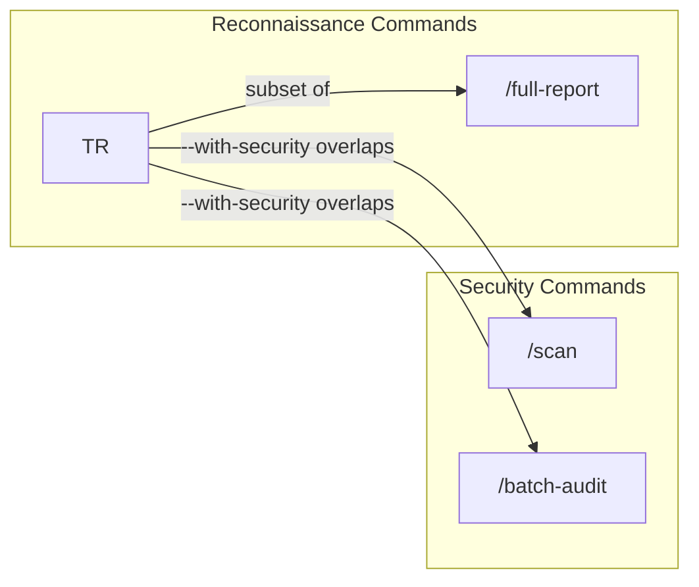

# Slash Commands

Reusable analysis workflows triggered with `/` in the Cursor chat input. In an
installed workspace they live under `.agent/commands/` inside a
`DeepExtractIDA_output_root`; in this source checkout they live in `commands/`.
The live registry (`registry.json`) is the source of truth for the current command set.

**Registry**: `registry.json` in this directory is the machine-readable source of truth for all commands -- listing purpose, referenced skills, agents, parameters, grind-loop usage, and workspace-protocol usage. It is loaded by `inject-module-context.py` at session start and validated by the infrastructure test suite.

Documentation: https://cursor.com/docs/context/commands

## Commands

| Command              | File                   | Purpose                                                                                             |
| -------------------- | ---------------------- | --------------------------------------------------------------------------------------------------- |
| `/triage`            | `triage.md`            | Full module triage: identity, classification, topology, attack surface, prioritized recommendations, optional quick security pass |
| `/audit`             | `audit.md`             | Security audit a specific function: dossier, verification, call chain, cross-module resolution, risk assessment; optional `--diagram` |
| `/lift-class`        | `lift-class.md`        | Batch-lift all methods of a C++ class with shared struct context into a cohesive `.cpp` file        |
| `/full-report`       | `full-report.md`       | End-to-end multi-phase analysis: RE report, classification, attack surface, topology, specialized   |
| `/compare-modules`   | `compare-modules.md`   | Cross-module comparison: dependencies, API overlap, classification distributions, call chains       |
| `/explain`           | `explain.md`           | Quick structured explanation of what a function does: purpose, parameters, APIs, call context       |
| `/search`            | `search.md`            | Cross-dimensional search: function names, signatures, strings, APIs, classes, exports               |
| `/reconstruct-types` | `reconstruct-types.md` | Reconstruct C/C++ struct and class definitions from memory access patterns                          |
| `/cache-manage`      | `cache-manage.md`      | View cache stats, clear, or refresh cached analysis results                                        |
| `/runs`              | `runs.md`              | List, inspect, and reopen prior workspace runs and step summaries                                  |
| `/health`            | `health.md`            | Pre-flight workspace validation: check extraction data, DBs, skills, and config                   |
| `/taint`             | `taint.md`             | Trace attacker-controlled inputs to dangerous sinks with guard/bypass analysis                     |
| `/hunt-plan`         | `hunt-plan.md`         | Hypothesis-driven VR and strategic research planning: campaign planning, cross-module campaigns, replan, tool/skill design, attack pattern matching, variant analysis, validation |
| `/hunt-execute`      | `hunt-execute.md`      | Execute a `/hunt-plan` research plan: run investigation commands, collect evidence, score confidence    |
| `/batch-audit`       | `batch-audit.md`       | Audit top N entry points or privilege-boundary handlers in parallel with consolidated security and exploitability report |
| `/xref`              | `xref.md`              | Quick cross-reference lookup: show callers and callees in a compact table                         |
| `/ai-logical-bug-scan` | `ai-logical-bug-scan.md` | Scan module for logic vulnerabilities (auth bypass, state errors, TOCTOU) with AI-driven verification |
| `/memory-scan`       | `memory-scan.md`       | Scan module for memory corruption (buffer overflows, integer issues, UAF, format strings)         |
| `/callgraph`         | `callgraph.md`         | Build, query, and visualize call graphs: stats, SCCs, hubs, roots/leaves, path queries, diagrams |
| `/imports`           | `imports.md`           | Query PE import/export relationships: who exports, who imports, dependency graphs, forwarders     |
| `/scan`              | `scan.md`              | Unified vulnerability scan: memory + logic + taint with verification and exploitability scoring   |
| `/diff`              | `diff.md`              | Compare two versions of a module: function deltas, classification shifts, attack surface changes  |
| `/prioritize`        | `prioritize.md`        | Cross-module finding ranking: load scan/audit results, normalize, rank by exploitability          |
| `/rpc`               | `rpc.md`               | RPC analysis: enumerate interfaces, map attack surface, audit security, trace chains, find clients, build topology, blast-radius, query stubs |
| `/winrt`             | `winrt.md`             | WinRT analysis: enumerate server classes, map privilege-boundary attack surface, audit security, classify entry points, find EoP targets |
| `/com`               | `com.md`               | COM analysis: enumerate servers by module/CLSID, map privilege-boundary attack surface, audit security (permissions, elevation, DCOM), classify entry points, find EoP/UAC bypass targets |
| `/pipeline`          | `pipeline.md`        | Run, validate, or inspect headless batch analysis pipelines from YAML definitions            |

## Command Decision Tree

Use this flowchart to determine which command to run based on your research goal:

```mermaid
flowchart TD
    Start["What do you want to do?"]
    Start --> Recon["Understand a module"]
    Start --> Function["Analyze a function"]
    Start --> Security["Security assessment"]
    Start --> Code["Work with code"]
    Start --> Plan["Plan research"]

    Recon --> Triage["/triage module -- deep orientation"]
    Recon --> FullReport["/full-report module"]
    Recon --> Compare["/compare-modules A B"]
    Function --> Explain["/explain module func"]
    Function --> Xref["/xref module func"]
    Function --> Search["/search module term"]

    Security --> Audit["/audit module func"]
    Security --> BatchAudit["/batch-audit module --top N or --privilege-boundary"]
    Security --> Taint["/taint module func"]
    Security --> HuntPlan["/hunt-plan module"]
    Security --> HuntExec["/hunt-execute module"]
    Security --> AiLogicScan["/ai-logical-bug-scan module"]
    Security --> MemScan["/memory-scan module"]
    Security --> Scan["/scan module"]
    Security --> Winrt["/winrt module -- WinRT server analysis"]
    Security --> Com["/com module -- COM server analysis"]

    Recon --> Callgraph["/callgraph module"]
    Recon --> Imports["/imports module"]

    Code --> LiftClass["/lift-class module class"]
    Code --> ReconstructTypes["/reconstruct-types module"]

    Start --> Utils["Utilities"]
    Utils --> Health["/health -- diagnose workspace issues"]
    Utils --> CacheManage["/cache-manage -- manage cached results"]
    Utils --> Runs["/runs -- inspect prior analyses"]
    Utils --> Pipeline["/pipeline run yaml -- batch pipelines"]
```



## Usage

Type `/` in the Cursor chat input to see all available commands, then select one and add arguments:

```
/triage appinfo.dll
/audit appinfo.dll AiCheckSecureApplicationDirectory
/audit appinfo.dll AiLaunchProcess --diagram
/lift-class appinfo.dll CSecurityDescriptor
/full-report cmd.exe
/compare-modules appinfo.dll cmd.exe
/explain appinfo.dll AiLaunchProcess
/search CreateProcess
/runs latest appinfo.dll
/reconstruct-types appinfo.dll CSecurityDescriptor
/hunt-plan appinfo.dll
/hunt-plan hypothesis TOCTOU appinfo.dll
/hunt-plan variant junction appinfo.dll
/hunt-plan validate appinfo.dll AiLaunchProcess
/hunt-plan surface appinfo.dll
/batch-audit appinfo.dll --privilege-boundary --top 8
/taint appinfo.dll AiLaunchProcess
/pipeline list-steps
/pipeline validate config/pipelines/security-sweep.yaml
/pipeline run config/pipelines/security-sweep.yaml --dry-run
```

Anything typed after the command name is passed as context to the agent.

## Parameter Conventions

- `<module>` -- Required module name. If not found, list available modules and ask.
- `[module]` -- Optional module name. If omitted, search all modules (may be slower).
- `<function>` -- Required function name or ID. If not found, run fuzzy search.
- `[function]` -- Optional function name. If omitted, list available options.
- `--search <pattern>` -- Pattern-based lookup alternative to exact name.

When module is optional and omitted, commands should:

1. Check if only one module exists (use it automatically)
2. If multiple modules, list them and ask the user to specify

## Command Details

### `/triage` -- Module Triage

**Input**: `/triage <module_name> [--with-security]` (e.g., `/triage explorer.exe`)

**What it does**:

1. Resolves the module to its analysis database
2. Extracts binary identity
3. Classifies all functions by purpose (file I/O, registry, crypto, security, etc.)
4. Computes call graph topology (hubs, connectivity, roots/leaves)
5. Discovers and ranks all entry points by attack value
6. Optionally runs a lightweight taint pass over top-ranked entry points when `--with-security` is present
7. Synthesizes a triage report with prioritized function list and recommended next steps

**Output**: Structured triage report in chat. With `--with-security`, adds a quick security findings section based on lightweight taint results. Suggests `/explain` for quick follow-ups, and `/audit`, `/lift-class`, `/scan`, or `/full-report` for deeper analysis.

**Agents used**: triage-coordinator (`analyze_module.py --goal triage` script)

**Skills used**: decompiled-code-extractor, ai-taint-scanner (optional, for `--with-security`)

---

### `/audit` -- Security Audit Function

**Input**: `/audit [module] <function_name>` (e.g., `/audit appinfo.dll AiCheckSecureApplicationDirectory`)

**What it does**:

1. Locates the function across analyzed modules
2. Builds a comprehensive security dossier (reachability, dangerous ops, resource patterns)
3. Extracts full function data (decompiled code, assembly, xrefs, strings)
4. Verifies decompiled code accuracy against assembly ground truth
5. Traces the outbound call chain to find dangerous operations
6. Classifies the function's purpose and role
7. Synthesizes an audit report with risk assessment (LOW/MEDIUM/HIGH/CRITICAL)

**Output**: Security audit report with attack reachability, dangerous operations, decompiler accuracy, data flow concerns, and recommended next steps.

**Agents used**: security-auditor (verification subagent)

**Skills used**: decompiled-code-extractor, security-dossier, map-attack-surface, callgraph-tracer, classify-functions, ai-taint-scanner

---

### `/lift-class` -- Batch-Lift Class Methods

**Input**: `/lift-class [module] <ClassName>` (e.g., `/lift-class appinfo.dll CSecurityDescriptor`)

**What it does**:

1. Collects all methods belonging to the class (constructors, destructors, methods)
2. Creates a session-scoped grind-loop scratchpad to track progress across methods
3. Reconstructs the struct/class layout from memory access patterns
4. Generates a lift plan with dependency order (callees first)
5. Lifts each function following the 10-step lifting workflow (validate assembly, rename variables, reconstruct structs, simplify control flow, document)
6. Assembles a single cohesive `.cpp` file with shared constants, struct, and all methods

**Output**: `extracted_code/<module>/lifted_<ClassName>.cpp` with struct definitions and all lifted methods.

**Uses grind loop**: Yes -- creates `.agent/hooks/scratchpads/{session_id}.md` with one checkbox per method. The stop hook automatically re-invokes the agent until all methods are lifted (up to 10 iterations).

**Skills used**: decompiled-code-extractor, batch-lift, reconstruct-types

---

### `/full-report` -- End-to-End Analysis

**Input**: `/full-report <module_name> [--brief]` (e.g., `/full-report appinfo.dll`)

**What it does** (6 phases):

1. **Identity**: Generates the base 10-section RE report (provenance, security, imports/exports, architecture, strings, topology, anomalies)
2. **Classification**: Triages and classifies all functions, filters noise
3. **Attack Surface**: Discovers all entry points, ranks by attack value, generates `entrypoints.json`
4. **Topology**: Computes call graph statistics, maps cross-module dependencies, generates Mermaid diagrams
5. **Specialized** (conditional): COM interfaces, dispatch tables, global state hotspots
6. **Synthesis**: Assembles all findings into a comprehensive markdown report with a prioritized analysis roadmap

**Output**: `extracted_code/<module>/full_analysis_report.md` and `entrypoints.json`. Chat summary with executive overview and top 5 analysis targets.

**Uses grind loop**: Yes -- creates `.agent/hooks/scratchpads/{session_id}.md` with one checkbox per phase. The stop hook automatically re-invokes the agent until all phases are complete.

**Agents used**: triage-coordinator (`generate_analysis_plan.py` for adaptive routing), re-analyst (`explain_function.py` for entry point explanations)

**Skills used**: decompiled-code-extractor, generate-re-report, classify-functions, map-attack-surface, callgraph-tracer, com-interface-reconstruction, ai-taint-scanner, security-dossier

---

### `/compare-modules` -- Cross-Module Comparison

**Input**: `/compare-modules <module_A> <module_B> [module_C ...]` or `/compare-modules --all`

**What it does**:

1. Resolves all module databases
2. Maps cross-module dependency relationships
3. Finds shared function calls between module pairs
4. Compares import/export API surfaces
5. Compares function classification distributions
6. Traces the most interesting cross-module call chains
7. Generates a Mermaid inter-module dependency diagram
8. Synthesizes a comparison report with architectural observations

**Output**: Cross-module comparison report with side-by-side profiles, dependency diagrams, shared function calls, capability differences, and recommended cross-boundary audit targets.

**Skills used**: decompiled-code-extractor, callgraph-tracer, generate-re-report, classify-functions, import-export-resolver

---

### `/explain` -- Explain Function

**Input**: `/explain [module] <function_name> [--depth N]` (e.g., `/explain appinfo.dll AiLaunchProcess`)

**What it does**:

1. Locates the function across analyzed modules
2. Extracts full context via `explain_function.py`: module context, classification, decompiled code, call chain, strings, dangerous APIs, callee code
3. Synthesizes a structured explanation: purpose, parameters, return value, behavior, key APIs, call context, confidence level

**Output**: Structured function explanation in chat with parameter table, behavior walkthrough, API summary, and follow-up suggestions.

**Scripts used**: re-analyst agent (`explain_function.py`, `re_query.py`), function-index

---

### `/search` -- Cross-Dimensional Search

**Input**: `/search [module] <search_term> [--dimensions dims]` (e.g., `/search CreateProcess` or `/search appinfo.dll --dimensions name,api CreateProcess`)

**What it does**:

1. Searches across all dimensions: function names, signatures, string literals, API calls, dangerous APIs, class names, and exports
2. Groups results by dimension with function IDs and match context
3. Highlights cross-dimensional hits and suggests follow-up commands

**Output**: Search results grouped by dimension with follow-up command suggestions based on result types.

**Scripts used**: unified_search.py (`python .agent/helpers/unified_search.py`)

---

### `/hunt-plan` -- Vulnerability Research Planning

**Input**: `/hunt-plan [mode] [module] [target]`

Examples:
- `/hunt-plan appinfo.dll` -- campaign mode (default): plan a full VR campaign
- `/hunt-plan hypothesis TOCTOU appinfo.dll` -- test a specific vulnerability hypothesis
- `/hunt-plan variant junction appinfo.dll` -- find variants of a known attack pattern
- `/hunt-plan validate appinfo.dll AiLaunchProcess` -- validate a suspected finding
- `/hunt-plan surface appinfo.dll` -- map trust boundaries and prioritize attack vectors

**What it does**:

1. Detects research mode from arguments (campaign, hypothesis, variant, validate, surface)
2. Gathers existing context (cached triage/attack-surface data)
3. Asks mode-specific questions about threat model, hypothesis, or pattern
4. Applies hypothesis generation, attack pattern matching, prioritization methodology
5. Presents a research plan with ranked hypotheses, per-hypothesis commands, and validation criteria
6. Iterates on feedback and transitions to an implementation plan via CreatePlan

**Output**: Collaborative dialogue producing an approved research design. No files are written.

**Skills used**: classify-functions, map-attack-surface, security-dossier, ai-taint-scanner

---

### `/hunt-execute` -- Execute Hunt Plan

**Input**: `/hunt-execute [module]` (e.g., `/hunt-execute appinfo.dll`)

**What it does**:

1. Locates the most recent `/hunt-plan` plan from the conversation
2. Creates a grind-loop scratchpad with one item per hypothesis
3. For each hypothesis, runs the mapped investigation commands (taint, audit, data-flow, etc.)
4. Collects evidence and scores confidence (CONFIRMED/LIKELY/POSSIBLE/UNLIKELY/REFUTED)
5. Synthesizes a findings report with confirmed vulnerabilities, refuted hypotheses, and next steps

**Output**: Investigation findings report with per-hypothesis evidence, confidence levels, and exploitation primitives.

**Uses grind loop**: Yes -- one checkbox per hypothesis.

**Agents used**: security-auditor (verification subagent)

**Skills used**: ai-taint-scanner, security-dossier, map-attack-surface, callgraph-tracer, exploitability-assessment

---

### `/batch-audit` -- Batch Security Audit

**Input**: `/batch-audit <module> [--top N] [--min-score S]`, `/batch-audit <module> func1 func2 ...`, `/batch-audit <module> --class ClassName`, or `/batch-audit <module> --privilege-boundary`

**What it does**:

1. Resolves audit targets (top N entry points, specific functions, class methods, or module-scoped RPC/COM/WinRT privilege-boundary handlers)
2. Creates a grind-loop scratchpad with one item per function
3. For each function: builds security dossier, runs taint analysis, assesses exploitability, classifies purpose
4. Synthesizes a consolidated batch audit report with cross-function patterns and privilege-boundary highlights when relevant

**Output**: Batch audit report with per-function risk ratings, top exploitable findings, cross-function patterns, and prioritized recommendations.

**Uses grind loop**: Yes -- one checkbox per function.

**Skills used**: security-dossier, ai-taint-scanner, exploitability-assessment, classify-functions, map-attack-surface

---

### `/winrt` -- WinRT Server Analysis

**Input**: `/winrt [subcommand] [module] [options]`

**What it does**:

1. Parses the subcommand (default/surface/methods/classify/audit/privesc)
2. Queries the WinRT index across four access contexts (caller IL x server privilege)
3. For default: enumerates server classes, interfaces, and methods
4. For surface: ranks servers by privilege-boundary risk tier
5. For privesc: identifies medium-IL to SYSTEM EoP targets
6. Synthesizes results with risk assessment and follow-up suggestions

**Output**: Structured analysis with risk tier distribution, ranked server lists, and recommended next steps.

**Skills used**: winrt-interface-analysis, decompiled-code-extractor, map-attack-surface

---

### `/com` -- COM Server Analysis

**Input**: `/com [subcommand] [module_or_clsid] [options]`

**What it does**:

1. Parses the subcommand (default/surface/methods/classify/audit/privesc)
2. Queries the COM index across four access contexts (caller IL x server privilege)
3. For default: enumerates COM servers, interfaces, and methods by module or CLSID
4. For surface: ranks servers by privilege-boundary risk tier
5. For audit: checks permissions, elevation flags, marshalling, DCOM exposure
6. For privesc: identifies medium-IL to SYSTEM EoP targets and UAC bypass candidates
7. Synthesizes results with risk assessment and follow-up suggestions

**Output**: Structured analysis with risk tier distribution, ranked server lists, security findings, and recommended next steps.

**Skills used**: com-interface-analysis, decompiled-code-extractor, map-attack-surface

---

### `/xref` -- Cross-Reference Lookup

**Input**: `/xref [module] <function_name>` (e.g., `/xref appinfo.dll AiLaunchProcess`)

**What it does**:

1. Locates the function across analyzed modules
2. Enriches with classification metadata via re-analyst `re_query.py` (category, interest score)
3. Extracts inbound xrefs (callers) and outbound xrefs (callees)
4. Classifies external callees by security API category
5. Presents results as compact tables annotated with category and interest

**Output**: Callers table, callees table (with category/interest columns for internal functions), summary line with counts and dangerous callee flags. Lightweight and fast.

**Agents used**: re-analyst (`re_query.py` for classification metadata)

**Skills used**: callgraph-tracer, function-index

---

### `/reconstruct-types` -- Type Reconstruction

**Input**: `/reconstruct-types <module> [class] [--include-com] [--validate]` (e.g., `/reconstruct-types appinfo.dll CSecurityDescriptor`)

**What it does**:

1. Resolves the module DB
2. Runs the full reconstruction pipeline via `reconstruct_all.py` (discover -> hierarchy -> scan -> merge -> COM -> header)
3. Optionally validates against assembly via `validate_layout.py`

**Output**: C++ header with struct/class definitions, per-field confidence annotations, and optional validation results.

**Agents used**: type-reconstructor (`reconstruct_all.py` script, `validate_layout.py` for `--validate`)

**Skills used**: reconstruct-types (underlying skill scripts called internally by `reconstruct_all.py`)

---

### `/scan` -- Unified Vulnerability Scan

**Input**: `/scan <module> [function] [--top N] [--no-cache] [--auto-audit]` (e.g., `/scan appinfo.dll`)

**What it does**:

1. Resolves the module DB
2. Runs the full 6-phase scan pipeline via `run_security_scan.py` (recon, scanning, taint, verification, exploitability, synthesis)

**Output**: Consolidated, severity-ranked findings report with exploitability scores.

**Agents used**: security-auditor (`run_security_scan.py` script)

---

### `/memory-scan` -- Memory Corruption Scan

**Input**: `/memory-scan <module> [function] [--depth N]` (e.g., `/memory-scan appinfo.dll`)

**What it does**: Scans for buffer overflows, integer overflow/truncation, use-after-free, double-free, and format string vulnerabilities. Includes chain scanning, taint cross-referencing, heuristic verification, and skeptical subagent verification.

**Agents used**: security-auditor (Phase D2 verification subagent)

**Skills used**: ai-memory-corruption-scanner, ai-taint-scanner, batch-lift, decompiled-code-extractor, security-dossier, classify-functions

---

### `/ai-logical-bug-scan` -- AI Logic Vulnerability Scan

**Input**: `/ai-logical-bug-scan <module> [function] [--depth N]` (e.g., `/ai-logical-bug-scan appinfo.dll`)

**What it does**: AI-driven scan for authentication bypasses, state machine errors, TOCTOU, confused deputy, missing security checks, and API misuse. Uses LLM agents with adversarial prompting, type-specific specialists, and skeptic verification.

**Agents used**: logic-scanner (specialist and skeptic subagents)

**Skills used**: ai-logic-scanner, ai-taint-scanner, decompiled-code-extractor, security-dossier, classify-functions

---

### `/taint` -- Taint Analysis

**Input**: `/taint <module> <function> [--depth N] [--cross-module]` (e.g., `/taint appinfo.dll AiLaunchProcess`)

**What it does**: Traces attacker-controlled inputs forward to dangerous sinks, identifies guards and bypass difficulty, and verifies findings with a skeptical subagent.

**Agents used**: security-auditor (Step 4 verification subagent)

**Skills used**: ai-taint-scanner, security-dossier, map-attack-surface, callgraph-tracer, exploitability-assessment

---

### `/callgraph` -- Call Graph Analysis

**Input**: `/callgraph <module> [function] [--stats] [--scc] [--roots] [--leaves] [--diagram] [--path A B]`

**What it does**: Builds, queries, and visualizes call graphs. In function neighborhood mode, enriches hub nodes with classification metadata.

**Agents used**: re-analyst (`re_query.py` for classification metadata in `--neighbors` mode)

**Skills used**: callgraph-tracer, function-index

---

### `/pipeline` -- Batch Pipeline

**Input**: `/pipeline run <yaml> [--dry-run] [--modules M] [--output DIR]`, `/pipeline validate <yaml>`, or `/pipeline list-steps`

**What it does**:

1. For `list-steps`: lists all available pipeline step types with their kind, description, and options
2. For `validate`: parses the YAML, validates steps and modules, reports warnings
3. For `run`: executes the pipeline across all resolved modules, running each step in sequence per module, with optional parallel module execution
4. For `run --dry-run`: resolves modules and plans execution without running any analysis

**Output**: Structured summary in chat. For `run`, includes per-module status table, per-step breakdown, elapsed time, and output directory path. For `validate`, shows resolved modules and rendered output path. For `list-steps`, shows a table of available steps.

**Agents used**: triage-coordinator (for goal-backed steps), security-auditor (for scan steps)

---

## Design

### Hybrid Skill References

Commands reference skills by name with script hints rather than hardcoding full script paths:

```
Use the **classify-functions** skill (`triage_summary.py --top 15`) to categorize all functions.
```

This gives the agent:

- **Skill identity**: reads the SKILL.md for full documentation, options, and edge cases
- **Script hint**: fast path to the right script without ambiguity
- **Maintainability**: if a skill's scripts change, only the SKILL.md needs updating

### Grind Loop Integration

The current registry marks these commands as grind-loop workflows:

- `/lift-class`
- `/full-report`
- `/hunt-execute`
- `/batch-audit`
- `/scan`

These commands create a session-scoped scratchpad at
`.agent/hooks/scratchpads/{session_id}.md`. Scratchpads are runtime-generated
artifacts, not committed source files. The stop hook
(`grind-until-done.py`) resolves the session ID from environment variables or
stdin metadata, checks for unchecked items, and re-invokes the agent
automatically, bounded by `loop_limit: 10` in root-level `hooks.json`. See
`.agent/rules/grind-loop-protocol.mdc` for the full protocol.

### Recommended Workflow

Start broad, then drill down. Use lightweight commands (`/explain`, `/search`) for quick answers, and heavyweight commands (`/audit`, `/lift-class`) for deep analysis:

```
/hunt-plan appinfo.dll           # Strategic: plan a hypothesis-driven VR campaign
/triage appinfo.dll              # What is this module? What's interesting?
  |
  |-- Quick (lightweight, single-step) --
  +--> /explain appinfo.dll FuncX          # What does this function do?
  +--> /search appinfo.dll "token"         # Find everything related to a term
  |
  |-- Deep (multi-step pipelines) --
  +--> /audit appinfo.dll FuncX            # Full security audit
  +--> /audit appinfo.dll ExportY --diagram  # Audit with call graph diagram
  +--> /lift-class appinfo.dll ClassZ      # Reconstruct a class
  +--> /reconstruct-types appinfo.dll      # Reconstruct struct/class definitions
  +--> /taint appinfo.dll FuncX                       # Trace taint flow
  |
  +--> /full-report appinfo.dll            # Comprehensive when you need everything
```

For multi-module analysis:

```
/triage moduleA.dll
/triage moduleB.dll
/compare-modules moduleA.dll moduleB.dll
```

## Skill Integration Map

Shows a representative core integration map for the most commonly chained
commands (abbreviated headers for width; `/types` = `/reconstruct-types`):

| Skill                        | `/triage` | `/audit` | `/lift-class` | `/full-report` | `/compare-modules` | `/explain` | `/search` | `/hunt-plan` |
| ---------------------------- | :-------: | :------: | :-----------: | :------------: | :----------------: | :-------: | :--------: | :-------: | :----------: |
| decompiled-code-extractor    |     x     |    x     |       x       |       x        |         x          |           |            |           |         |
| generate-re-report           |     x     |          |               |       x        |         x          |           |            |           |         |
| classify-functions           |     x     |    x     |               |       x        |         x          |           |            |           |    x    |
| callgraph-tracer             |     x     |    x     |               |       x        |         x          |           |            |           |         |
| map-attack-surface           |     x     |          |               |       x        |                    |           |            |           |    x    |
| security-dossier             |           |    x     |               |                |                    |           |            |           |    x    |
| batch-lift                   |           |          |       x       |                |                    |           |            |           |         |
| reconstruct-types            |           |          |       x       |                |                    |           |            |           |         |
| com-interface-reconstruction |           |          |               |      x\*       |                    |           |            |           |         |
| function-index               |     x     |    x     |               |       x        |         x          |     x     |     x      |           |         |
| import-export-resolver       |           |    x     |               |                |                    |           |            |           |         |
| re-analyst                   |           |          |               |                |                    |           |     x      |           |         |
| unified-search               |           |          |               |                |                    |           |            |     x     |

\*Conditional -- only if relevant signals are detected in earlier phases.

### Shared Infrastructure

- **function-index**: Function-to-file resolution, library tag filtering, module stats. Used by `/audit` (quick lookup, callee resolution), `/triage` (noise ratio), `/full-report` (classification stats), `/compare-modules` (comparative stats).
- **unified-search** (`python .agent/helpers/unified_search.py <db> --query <term>`): Cross-dimensional search across function names, signatures, strings, APIs, classes, and exports in one call. Use when you don't know which dimension a term belongs to, or want a quick overview of everything related to a search term. Supports `--json`, `--dimensions`, `--limit`, and `--all` (search all modules). See the [function-index SKILL.md](../skills/function-index/SKILL.md#unified-search-cross-dimensional) for details.

## Methodologies

Some commands reference **methodology skills** -- documentation-only skills that encode analysis frameworks, reasoning patterns, or verification workflows. These skills have no scripts; they teach the agent *how to think* about a task.

| Command          | Methodology Skill        | Effect                                                                                      |
| ---------------- | ------------------------ | ------------------------------------------------------------------------------------------- |

## Vulnerability Scanning: `/scan` vs Focused Commands

`/scan` is the **unified vulnerability pipeline** that runs memory corruption detection, logic vulnerability detection, and taint analysis in a single workflow with exploitability scoring. The focused commands provide narrower analysis when you know what you're looking for.

| When to use             | Command                                    |
| ----------------------- | ------------------------------------------ |
| Comprehensive module-wide vulnerability coverage | `/scan <module>` -- runs all scanners, adds exploitability scoring |
| Only memory corruption (buffer overflow, UAF, integer, format string) | `/memory-scan <module>` |
| Only logic vulnerabilities (auth bypass, state errors, TOCTOU) | `/ai-logical-bug-scan <module>` |
| Only taint analysis (source-to-sink tracing) | `/taint <module> <function>` |
| Breadth-first audit of top entry points | `/batch-audit <module>` -- dossier + taint + exploitability per function |
| Deep single-function audit | `/audit <module> <function>` -- full pipeline with backward trace, verification, call chain |

`/batch-audit` trades depth for breadth: it runs dossier + taint + exploitability + classification for each function, but omits the full `/audit` pipeline (backward trace, decompiler verification, call chain analysis). Use `/batch-audit` to prioritize targets, then `/audit` for the most interesting ones.

## Command Depth Spectrum

The reconnaissance commands form a strict depth progression, while the security commands occupy a separate axis. The `/triage --with-security` flag bridges the two domains with a lightweight taint pass.



| Command | Scope | Depth | Steps | Grind Loop | Security Coverage |
|---------|-------|-------|-------|------------|-------------------|
| `/triage` | Module | Thorough orientation | 5-6 (identity, classify, callgraph, attack surface, optional taint) | No | Optional lightweight taint on top 3-5 entries (`--with-security`) |
| `/full-report` | Module | Exhaustive | 6 phases (identity, classify, attack surface + dossiers + taint, topology + diagrams, specialized, synthesis) | Yes | Taint + dossiers on top entries (always), COM/dispatch/types (adaptive) |
| `/scan` | Module | Deep (security-only) | 5 phases (8 scanners + taint, merge, verify, exploitability, synthesis) | Yes | Full: memory corruption + logic flaws + taint + verification + exploitability |
| `/batch-audit` | Per-function | Deep (security-only) | Per-function pipeline (dossier, taint, exploitability, classify) | Yes | Dossier + taint + exploitability per function; privilege-boundary discovery |

No two commands are redundant -- each occupies a distinct point on the depth/breadth spectrum. `/triage` is the natural first command and the natural stepping stone toward `/full-report`, `/scan`, or `/audit`.

## Files

```
.agent/commands/
  registry.json             # Machine-readable command contracts
  README.md                 # This file
  triage.md                 # /triage
  audit.md                  # /audit
  lift-class.md             # /lift-class
  full-report.md            # /full-report
  compare-modules.md        # /compare-modules
  explain.md                # /explain
  search.md                 # /search
  reconstruct-types.md      # /reconstruct-types
  cache-manage.md           # /cache-manage
  runs.md                   # /runs
  health.md                 # /health
  taint.md                  # /taint
  hunt-plan.md              # /hunt-plan
  hunt-execute.md           # /hunt-execute
  batch-audit.md            # /batch-audit
  xref.md                   # /xref
  memory-scan.md            # /memory-scan
  ai-logical-bug-scan.md    # /ai-logical-bug-scan
  callgraph.md              # /callgraph
  imports.md                # /imports
  scan.md                   # /scan
  diff.md                   # /diff
  prioritize.md             # /prioritize
  rpc.md                    # /rpc
  winrt.md                  # /winrt
  com.md                    # /com
  pipeline.md               # /pipeline
```
