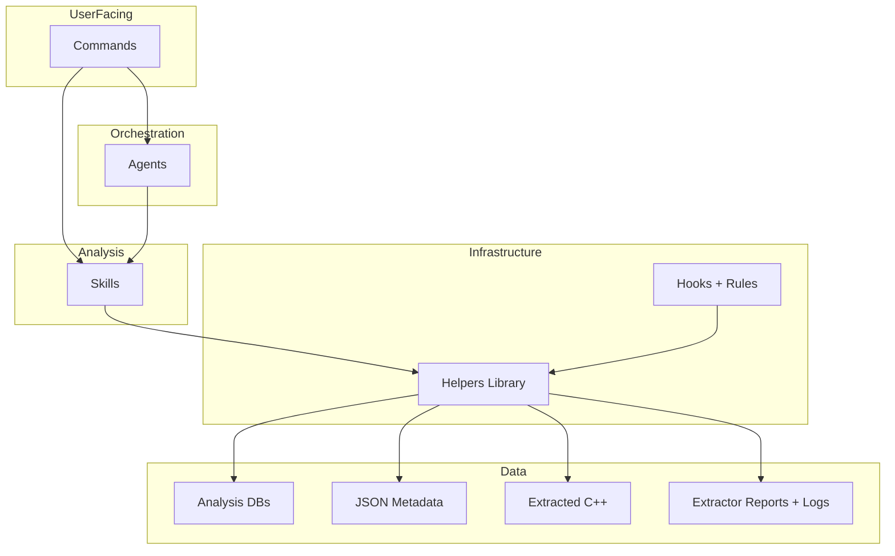
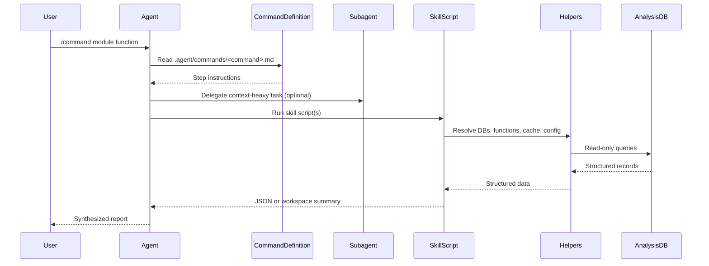

# Architecture

The DeepExtractIDA Agent Analysis Runtime is installed as `.agent/` inside a
`DeepExtractIDA_output_root`. DeepExtractIDA produces the extractor outputs at
workspace root; this runtime adds commands, agents, hooks, rules, cache, and
workspace orchestration on top of those artifacts.

---

## Installed Workspace Model

The runtime is designed around a two-layer workspace:

1. **Extractor-managed root artifacts** produced by DeepExtractIDA
2. **Runtime-managed overlay** installed at `.agent/`

```text
<DeepExtractIDA_output_root>/
  AGENTS.md
  CLAUDE.md
  extraction_report.json
  logs/
  idb_cache/                    Optional extractor cache
  extracted_code/
    <module>/
      *.cpp
      file_info.json
      function_index.json
      module_profile.json
  extracted_dbs/
    analyzed_files.db           Extractor-default tracking DB
    <module>_<hash>.db
  .agent/
    commands/
    agents/
    skills/
    helpers/
    hooks/
    rules/
    config/
    cache/
    workspace/
    tests/
    docs/
  hooks.json
```

The tracking DB normally lives at `extracted_dbs/analyzed_files.db`. The helper
layer also supports a root-level `analyzed_files.db` fallback for compatibility
with older or single-file layouts.

---

## Layered Architecture

The runtime is organized into five layers. Each layer depends only on the
layers below it.



### Commands

Commands are user-facing Markdown workflows loaded from `.agent/commands/`.
The live registry currently defines **36 commands**.

### Agents

Agents are specialized subagents loaded from `.agent/agents/`. The live
registry currently defines **6 agents**:

- `re-analyst`
- `triage-coordinator`
- `security-auditor`
- `type-reconstructor`
- `verifier`
- `code-lifter`

### Skills

Skills are reusable analysis pipelines under `.agent/skills/`. The live
registry currently defines **29 skills**, ranging from extraction helpers and
call graph analysis to reconstruction, scanning, exploitability assessment, and
methodology-only guidance.

### Helpers

Helpers are the shared Python API under `.agent/helpers/`. They own DB access,
function resolution, config, cache, JSON output, progress reporting, workspace
handoff, and batch pipeline support.

### Hooks And Rules

Hooks live at `.agent/hooks/` and are activated from root-level `hooks.json`.
Rules live at `.agent/rules/` and define the behavioral conventions that keep
commands, agents, and skills consistent.

---

## Data Layer

The runtime treats all extractor outputs as **read-only**.

### Analysis Databases

Each `extracted_dbs/<module>_<hash>.db` contains function records, assembly,
decompiled code, cross-references, strings, file metadata, and schema version
information. Helper-mediated access enforces `PRAGMA query_only = ON`.

The tracking DB, usually `extracted_dbs/analyzed_files.db`, maps module names
and hashes to concrete analysis DB paths.

### JSON Metadata

Each `extracted_code/<module>/` directory contributes:

- `function_index.json` for fast function-to-file resolution
- `file_info.json` for binary metadata and function summaries
- `module_profile.json` for precomputed fingerprints and security posture

### Extracted Code

Grouped `.cpp` files under `extracted_code/<module>/` are the human-readable
view of the decompiled codebase. Reports generated by runtime commands are also
saved back into module-specific `reports/` directories under `extracted_code/`.

### Extractor Provenance

The output root may also contain:

- `extraction_report.json` for batch extraction provenance and status
- `logs/` for extractor and symbol resolution logs
- `idb_cache/` for optional cached IDA databases

---

## Execution Model

### Request Flow



Not every request uses every layer. Lightweight commands may call helpers or a
single skill directly; deeper workflows often use both subagents and multiple
skills.

### Workspace Handoff

Multi-step workflows write intermediate outputs under `.agent/workspace/`:

```text
.agent/workspace/<module>_<goal>_<timestamp>/
  manifest.json
  <step_name>/
    results.json
    summary.json
```

This keeps large payloads out of the agent context while preserving detailed
artifacts on disk. `helpers.workspace.py` is the source of truth for run
directory creation and manifest/result I/O.

### Grind Loop

Long-running iterative workflows use session-scoped scratchpads under
`.agent/hooks/scratchpads/{session_id}.md`:

1. A command or agent creates checklist items.
2. The agent checks items off as work completes.
3. The `stop` hook reads the scratchpad when the turn ends.
4. If unchecked items remain, the hook emits a follow-up message.
5. The host re-invokes the agent, bounded by `loop_limit` in `hooks.json`.

### Headless Pipeline Mode

`helpers/pipeline_cli.py` reuses the same runtime layers for batch execution.
The `/pipeline` slash command provides interactive access to the same CLI:

- `helpers.pipeline_schema` parses YAML and validates step names
- `helpers.pipeline_executor` coordinates module iteration and dispatch
- `triage-coordinator/analyze_module.py` backs `triage`, `security`,
  `full-analysis`, and `types`
- `security-auditor/run_security_scan.py` backs the full `scan` step
- direct skill-group steps still write to `.agent/workspace/`

The `workspace/...` output shorthand in pipeline YAML is normalized into
`.agent/workspace/...` by `helpers.pipeline_schema.render_output_path()`.

---

## Lifecycle Hooks

Installed workspaces configure **3** hook events in root-level `hooks.json`.

> Hook commands run relative to the output root, not relative to `.agent/`.

| Event | Script | Timeout | Purpose |
| ----- | ------ | ------- | ------- |
| `sessionStart` | `.agent/hooks/inject-module-context.py` | 15s | Inject module, registry, cache, and README overview context |
| `stop` | `.agent/hooks/grind-until-done.py` | 5s | Continue iterative work while scratchpad items remain |
| `sessionEnd` | `.agent/hooks/cleanup-workspace.py` | 10s | Remove stale run artifacts, state files, and cache |

### sessionStart

The session-start hook scans the output root and runtime overlay:

- `extracted_code/*/file_info.json`
- `extracted_code/*/module_profile.json`
- `extracted_dbs/*.db`
- `.agent/skills/*/SKILL.md`
- `.agent/rules/*.mdc`
- `skills/registry.json`, `agents/registry.json`, `commands/registry.json`
- README overviews for skills, commands, and agents at `full` context level

It also resolves a session ID and ensures
`.agent/hooks/scratchpads/` exists.

### stop

The stop hook reads the session scratchpad, parses checkbox state, and either:

- emits `{}` when everything is done, or
- emits `{ "followup_message": "..." }` when work remains

It also prunes stale scratchpads.

### sessionEnd

The session-end hook delegates to `helpers.cleanup_workspace.cleanup_workspace()`
to clean:

- stale `.agent/workspace/` runs
- stale agent state files
- stale cache entries

---

## Rules

The runtime currently ships **6** rules in `.agent/rules/`:

| Rule | Purpose |
| ---- | ------- |
| `workspace-pattern.mdc` | Multi-step filesystem handoff contract |
| `workspace-layout.mdc` | Installed output-root and `.agent/` path conventions |
| `grind-loop-protocol.mdc` | Scratchpad structure and iteration behavior |
| `error-handling-convention.mdc` | Entry-point vs library error model |
| `json-output-convention.mdc` | stdout/stderr and JSON wrapping conventions |
| `missing-dependency-handling.mdc` | Graceful degradation behavior |

---

## Registries And Discoverability

Each runtime directory maintains two indexes:

- `registry.json` for machine-readable contracts
- `README.md` for human-readable guidance

The session-start hook reads the command, agent, and skill registries together
to build the initial routing context for every conversation.

---

## Testing

Installed-workspace command:

```bash
cd <DeepExtractIDA_output_root>/.agent && python -m pytest tests/ -v
```

The suite validates registry consistency, helper behavior, hook behavior,
workspace handoff, and integration across the layered architecture.

---

## Further Reading

| Topic | Document |
| ----- | -------- |
| End-to-end request flow | [integration_guide.md](integration_guide.md) |
| Headless batch pipelines | [pipeline_guide.md](pipeline_guide.md) |
| Writing commands | [command_authoring_guide.md](command_authoring_guide.md) |
| Writing agents | [agent_authoring_guide.md](agent_authoring_guide.md) |
| Writing skills | [skill_authoring_guide.md](skill_authoring_guide.md) |
| Helper APIs | [helper_api_reference.md](helper_api_reference.md) |
| Extractor data formats | [data_format_reference.md](data_format_reference.md) |
