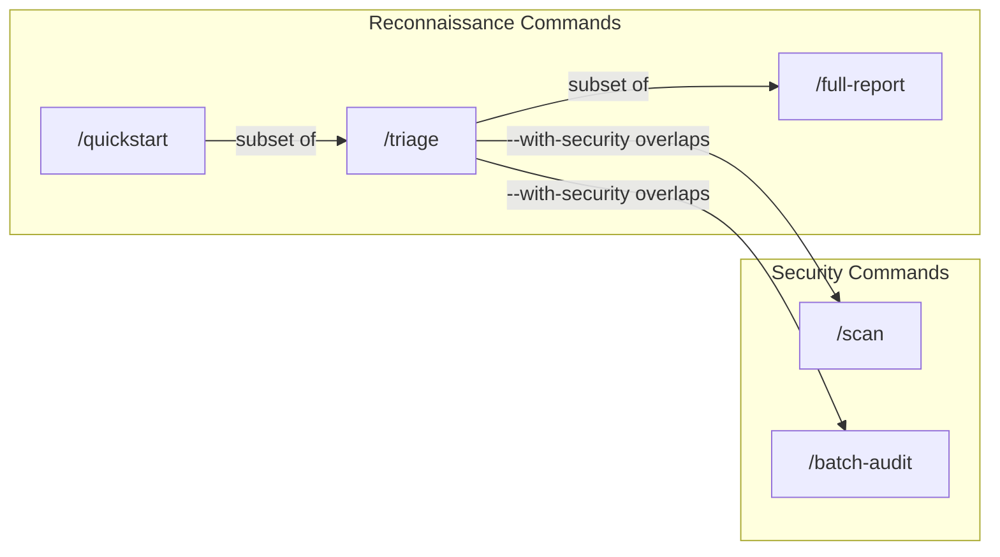

# Command Depth Spectrum

How the reconnaissance and security commands relate to each other -- subset
relationships, overlap zones, and the depth/breadth trade-offs that determine
which command to use.

---

## Relationship Diagram



## Depth Progression

The three reconnaissance commands form a strict depth progression:

| Command | Scope | Depth | Steps | Grind Loop | Security Coverage |
|---------|-------|-------|-------|------------|-------------------|
| `/quickstart` | Module | Quick look | 3 (classify, entries, callgraph) | No | None |
| `/triage` | Module | Thorough orientation | 5-6 (identity, classify, callgraph, attack surface, optional taint) | No | Optional lightweight taint on top 3-5 entries (`--with-security`) |
| `/full-report` | Module | Exhaustive | 6 phases (identity, classify, attack surface + dossiers + taint, topology + diagrams, specialized, synthesis) | Yes | Taint + dossiers on top entries (always), COM/dispatch/types (adaptive) |

Each level is a strict superset of the one before it:

- **`/quickstart`** runs 3 lightweight cached analyses (classification top 5,
  entry point discovery, call graph stats). It auto-selects the most
  interesting module and suggests `/triage` as the next step.

- **`/triage`** adds binary identity (RE report), full classification (not
  just top 5), and attack surface ranking. With `--with-security`, it also
  runs a lightweight taint pass on the top 3-5 ranked entry points.

- **`/full-report`** adds security dossiers and taint analysis on top entries
  (always, not just with a flag), cross-module dependency mapping, Mermaid
  call graph diagrams, and an adaptive Phase 5 that conditionally runs COM
  interface reconstruction, dispatch table extraction, global state mapping,
  decompilation quality checks, and type reconstruction.

## The Security Bridge

The `--with-security` flag on `/triage` creates a small bridge into the
security domain. It runs `taint_function.py` on the top 3-5 ranked entry
points at depth 2 -- enough to surface a quick signal of exploitable issues,
but intentionally lightweight. It is **not** a substitute for proper security
analysis.

The proper security tools are:

| Command | Scope | Depth | What It Adds Over `/triage --with-security` |
|---------|-------|-------|---------------------------------------------|
| `/scan` | Module | Deep (security-only) | 8 scanners (memory + logic), verification against assembly, exploitability scoring, deduplication across pipelines |
| `/batch-audit` | Per-function | Deep (security-only) | Security dossier + taint + exploitability + classification per function; privilege-boundary discovery (RPC/COM/WinRT) |

`/scan` provides breadth across vulnerability classes (buffer overflows,
integer issues, UAF, format strings, auth bypasses, state errors, TOCTOU,
logic flaws). `/batch-audit` provides depth per function with dossier-level
context and privilege-boundary awareness.

## No Redundancy

No two commands are redundant -- each occupies a distinct point on the
depth/breadth spectrum. `/triage` is the natural "second command" after
`/quickstart` and the natural stepping stone toward `/full-report`, `/scan`,
or `/audit`.

Typical progression:

```
/quickstart              # First contact -- what modules exist, what's interesting?
    |
    v
/triage <module>         # Thorough orientation -- identity, classification, attack surface
    |
    +---> /full-report   # When you need everything about the module
    +---> /scan          # When you want comprehensive vulnerability coverage
    +---> /batch-audit   # When you want to audit the top entry points in breadth
    +---> /audit <func>  # When you want to deep-dive a single function
```

## Related Documentation

- [Commands README](../commands/README.md) -- command catalog, decision tree, skill integration map
- [Scan/Audit/Taint Workflow](scan-audit-taint-workflow.md) -- security pipeline drill-down and finding follow-up
- [VR Workflow Overview](vr_workflow_overview.md) -- exhaustive reference for all commands, agents, skills, and helpers
