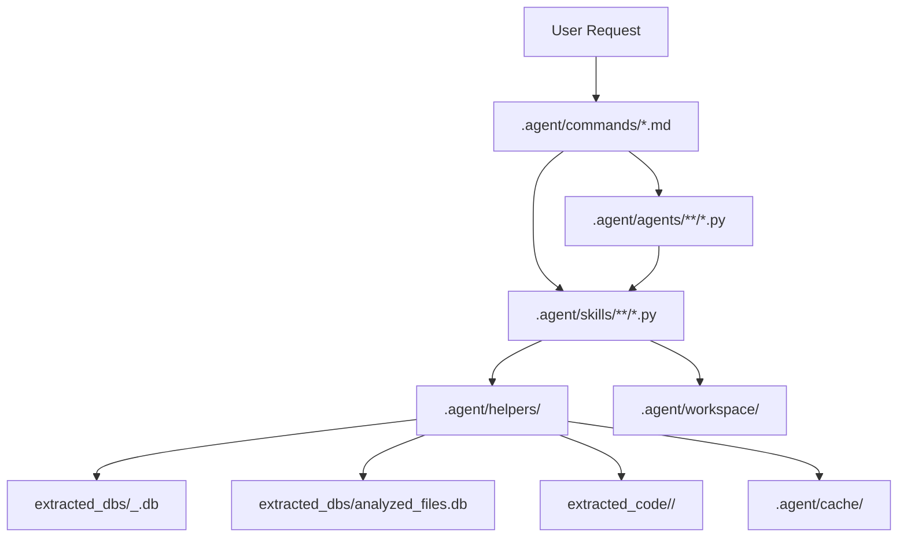

# Integration Guide: End-to-End Data Flow

This guide walks through how the installed runtime behaves inside a
`DeepExtractIDA_output_root`, where extractor outputs live at workspace root and
the runtime itself is installed under `.agent/`.

---

## Output Root Model

The examples below assume a workspace shaped like this:

```text
<DeepExtractIDA_output_root>/
  extraction_report.json
  logs/
  extracted_code/
  extracted_dbs/
  .agent/
    commands/
    agents/
    skills/
    helpers/
    workspace/
  hooks.json
```

The tracking DB normally lives at `extracted_dbs/analyzed_files.db`. The helper
layer also supports a root-level `analyzed_files.db` fallback.

---

## Example: How `/triage appinfo.dll` Works

### 1. Command Dispatch

The user types `/triage appinfo.dll`. The agent resolves that to
`.agent/commands/triage.md`, which defines the workflow, the
workspace-handoff expectations, and the optional `--with-security` branch.

### 2. Preflight Validation

The command definition starts by validating the module argument through
`helpers.command_validation.validate_command_args("triage", ...)`.

That preflight step resolves:

- the module name
- the analysis DB path
- any validation errors that should stop execution early

### 3. Module Resolution

The runtime then uses the **decompiled-code-extractor** skill:

```bash
python .agent/skills/decompiled-code-extractor/scripts/find_module_db.py appinfo.dll --json
```

Internally, the helper layer:

1. Calls `helpers.db_paths.resolve_tracking_db()`
2. Checks `extracted_dbs/analyzed_files.db` first
3. Falls back to a root-level `analyzed_files.db` if needed
4. Resolves `appinfo.dll` to a concrete DB path such as
   `extracted_dbs/appinfo_dll_f2bbf324a1.db`

### 4. Workspace Setup

Before the multi-step workflow starts, the runtime creates a run directory
under `.agent/workspace/`:

```text
.agent/workspace/appinfo.dll_triage_20260306_120000/
  manifest.json
```

Every skill invocation receives:

- `--workspace-dir <run_dir>`
- `--workspace-step <step_name>`

The workspace bootstrap captures full stdout, writes `results.json` and
`summary.json` for each step, and updates `manifest.json`.

### 5. Triage Pipeline

`/triage` runs the following logical phases:

1. **Binary identity**
   Uses `generate_report.py --summary` from `generate-re-report`
2. **Classification**
   Uses `triage_summary.py --top 15` from `classify-functions`
3. **Call graph topology**
   Uses `build_call_graph.py --stats` from `callgraph-tracer`
4. **Attack surface**
   Uses `discover_entrypoints.py` and `rank_entrypoints.py` from
   `map-attack-surface`
5. **Optional quick security**
   If the command includes `--with-security`, runs a lightweight taint pass on
   the top ranked entry points via `taint_function.py`

The command definition marks phases 2, 3, and 4 as parallelizable once module
resolution succeeds. The optional security phase depends on ranked entry points
from the attack-surface step.

### 6. Result Assembly

After the step summaries are written, the agent synthesizes the final chat
report from:

```text
.agent/workspace/appinfo.dll_triage_20260306_120000/<step>/summary.json
```

Full payloads remain available in the corresponding `results.json` files for
follow-up analysis.

The final report is also saved back into the extractor output tree:

```text
extracted_code/appinfo_dll/reports/triage_appinfo.dll_20260306_1200.md
```

---

## Example: How `pipeline_cli.py run config/pipelines/security-sweep.yaml` Works

Headless batch mode reuses the same helpers, agents, skills, and workspace
handoff as interactive slash commands. The `/pipeline` slash command provides
interactive access to the same functionality.

### 1. YAML Load And Validation

The user runs:

```bash
python .agent/helpers/pipeline_cli.py run config/pipelines/security-sweep.yaml
```

The runner:

1. Parses YAML with `helpers.pipeline_schema.load_pipeline()`
2. Validates steps against `STEP_REGISTRY`
3. Resolves modules to DB paths
4. Validates each DB with `validate_analysis_db()`

The current top-level step vocabulary includes:

- goal-backed steps: `triage`, `security`, `full-analysis`, `types`
- scan orchestration: `scan`
- direct skill-group steps: `memory-scan`, `logic-scan`, `taint`, `classify`,
  `entrypoints`, `callgraph`, `dossiers`

### 2. Batch Output Setup

The pipeline output template is rendered into a directory under
`.agent/workspace/`:

```text
.agent/workspace/batch_security-sweep_20260306_010203/
  batch_manifest.json
  batch_summary.json
```

If a pipeline YAML uses the shorthand `workspace/...`, the schema layer maps it
to `.agent/workspace/...`.

### 3. Step Dispatch

The executor dispatches steps in two ways:

- **Goal-backed steps** reuse existing agent scripts such as
  `.agent/agents/triage-coordinator/scripts/analyze_module.py`
- **Security scan orchestration** uses
  `.agent/agents/security-auditor/scripts/run_security_scan.py`
- **Direct skill-group steps** call skill scripts with `run_skill_script()`

For example, a `security` step for `appinfo.dll` produces a module-local
workspace tree like:

```text
.agent/workspace/batch_security-sweep_20260306_010203/
  appinfo.dll/
    security/
      manifest.json
      classify_triage/results.json
      classify_full/results.json
      discover_entrypoints/results.json
      rank_entrypoints/results.json
      dossier_<function>/results.json
      taint_<function>/results.json
```

### 4. Batch Summary Generation

When all modules finish, the executor writes:

- `batch_manifest.json` for incremental status
- `batch_summary.json` for the final consolidated result

The CLI then prints either human-readable text or JSON, depending on `--json`.

---

## Data Flow Diagram



---

## Cross-Module Resolution

When a function crosses a DLL boundary:

1. The outbound xref identifies the target module and function
2. The helper layer looks up the target module in the tracking DB
3. If that target module was also extracted, the runtime opens its DB
4. Function resolution proceeds in the target module

This is what enables cross-module call chain tracing for commands like
`/audit` (Step 4c), `/data-flow-cross`, `/imports`, and `/compare-modules`.

---

## Error Handling Flow

```text
Script entry point
  ->
db_error_handler(db_path, "operation")
  ->
emit_error(msg, code)
  OR
log_warning(msg, code)
  OR
raise ScriptError(msg, code)
```

Entry-point scripts emit structured errors for the host; library code raises
`ScriptError`; non-fatal conditions become warnings.

See [architecture.md](architecture.md) for the full installed-workspace model.
