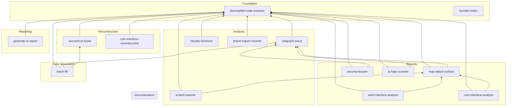

# Analysis Skills

Skills are reusable analysis pipelines that form the core analytical
capabilities of the Agent Analysis Runtime. Each skill lives in
`skills/<name>/` with a `SKILL.md` manifest describing its purpose,
data sources, scripts, and workflows, plus a `scripts/` directory
containing Python entry points. Skills are invoked by agents and slash
commands, and they call shared helpers to query analysis databases and
JSON files produced by DeepExtractIDA.

The machine-readable registry of all skills is in
[`registry.json`](registry.json). It defines entry scripts, accepted
arguments, dependencies, and caching contracts for each skill.

---

## Overview

| Skill | Type | Purpose | Scripts | Cacheable | Dependencies |
|-------|------|---------|---------|-----------|--------------|
| [batch-lift](#batch-lift) | code_generation | Lift related function groups with shared context | 2 | No | decompiled-code-extractor, callgraph-tracer, reconstruct-types |
| [callgraph-tracer](#callgraph-tracer) | analysis | Build call graphs, trace paths, cross-module deps | 6 | Yes | decompiled-code-extractor |
| [classify-functions](#classify-functions) | analysis | Classify every function by purpose | 3 | Yes | decompiled-code-extractor |
| [com-interface-reconstruction](#com-interface-reconstruction) | reconstruction | Reconstruct COM/WRL interfaces from vtable patterns | 4 | Yes | decompiled-code-extractor |
| [ai-taint-scanner](#ai-taint-scanner) | security | AI-driven taint analysis with cross-module data flow tracing, trust boundary analysis, and skeptic verification | 2 | No | decompiled-code-extractor, map-attack-surface |
| [decompiled-code-extractor](#decompiled-code-extractor) | foundation | Extract function data from analysis databases | 4 | No | -- |
| [function-index](#function-index) | index | Fast function-to-file resolution and library filtering | 3 | No | -- |
| [generate-re-report](#generate-re-report) | reporting | Comprehensive RE reports (identity, security, architecture) | 6 | Yes | decompiled-code-extractor |
| [map-attack-surface](#map-attack-surface) | security | Discover entry points, rank by attack value | 3 | Yes | decompiled-code-extractor, callgraph-tracer, import-export-resolver |
| [reconstruct-types](#reconstruct-types) | reconstruction | Reconstruct structs/classes from memory access patterns | 4 | Yes | decompiled-code-extractor |
| [security-dossier](#security-dossier) | security | Security context dossier (reachability, dangerous ops) | 1 | Yes | decompiled-code-extractor, callgraph-tracer |
| [import-export-resolver](#import-export-resolver) | analysis | Resolve PE import/export relationships across modules | 4 | Yes | decompiled-code-extractor |
| [ai-memory-corruption-scanner](#ai-memory-corruption-scanner) | security | AI-driven memory corruption scanning with callgraph navigation, adversarial prompting, and skeptic verification | 2 | No | decompiled-code-extractor, map-attack-surface |
| [exploitability-assessment](#exploitability-assessment) | security | Assess exploitability of taint findings with guard analysis | 2 | No | ai-taint-scanner, security-dossier, map-attack-surface, ai-memory-corruption-scanner, ai-logic-scanner |
| [ai-logic-scanner](#ai-logic-scanner) | security | AI-driven logic vulnerability scanning with callgraph navigation and adversarial prompting | 2 | No | decompiled-code-extractor, map-attack-surface |
| [rpc-interface-analysis](#rpc-interface-analysis) | security | Analyze RPC interfaces: enumerate UUIDs, map attack surface, audit security, trace chains, find clients, build topology, blast-radius, query stubs | 6 | No | decompiled-code-extractor, map-attack-surface, callgraph-tracer |
| [winrt-interface-analysis](#winrt-interface-analysis) | security | Analyze WinRT servers: enumerate classes, map privilege-boundary surface, audit security, classify methods, find EoP | 6 | No | decompiled-code-extractor, map-attack-surface |
| [com-interface-analysis](#com-interface-analysis) | security | Analyze COM servers: enumerate CLSIDs, map privilege-boundary surface, audit security (permissions, elevation, DCOM), classify methods, find EoP/UAC bypass | 6 | No | decompiled-code-extractor, map-attack-surface |

---

## Skill Dependency Graph



---

## Skill Details

### Foundation

#### decompiled-code-extractor

The foundational data-extraction skill that nearly every other skill
depends on. Its scripts locate module analysis databases, list and search
functions within them, and extract all raw data for a given function --
decompiled C++, raw x64 assembly, signatures, string literals, xrefs,
vtable contexts, global variable accesses, stack frames, and loop
analysis. The scripts are purely data retrieval and do not perform any
lifting or rewriting.

**Key scripts:** `find_module_db.py` (map module name to DB path),
`list_functions.py` (list/search functions), `extract_function_data.py`
(extract all data for a single function). All three are data extraction
only.

**Typical use:** Starting point for any function-level analysis. Run
`find_module_db.py` first to get the DB path, then use
`extract_function_data.py` to retrieve everything needed for lifting,
verification, or deeper analysis. The actual lifting is performed by the
code-lifter agent.

---

#### function-index

Provides fast, JSON-based function-to-file resolution without touching
SQLite databases. Every extracted module has a `function_index.json` that
maps each function name to its `.cpp` file and a library tag (`WIL`,
`STL`, `WRL`, `CRT`, `ETW/TraceLogging`, or `null` for application
code). This skill wraps that index with lookup, filtering, and
resolution scripts, and is the recommended first step for locating a
function's source file. It has no dependencies on other skills.

**Key scripts:** `lookup_function.py` (find functions by exact name,
substring, or regex across all modules), `index_functions.py` (list and
filter module functions, show stats), `resolve_function_file.py`
(resolve function names to absolute `.cpp` file paths).

**Typical use:** Before reading any decompiled code, use
`lookup_function.py` to find which module and file contains the target
function, then read the resolved path directly. Use `--app-only` to
skip library boilerplate and focus on application logic.

---

### Analysis

#### callgraph-tracer

Builds directed call graphs from per-function cross-reference data in
analysis databases and supports a rich set of graph queries: shortest
path, all paths, reachability from entry points, transitive callers,
strongly connected components (recursive clusters), leaf functions, and
root functions. Its headline capability is **cross-module chain
analysis** -- following function calls across DLL boundaries by
resolving external xrefs through the tracking database, retrieving
decompiled code at each hop. It also generates Mermaid and DOT diagrams,
and maps inter-module dependency relationships across all analyzed
binaries.

**Key scripts:** `build_call_graph.py` (single-module graph queries),
`chain_analysis.py` (cross-module xref chain traversal with code
retrieval), `cross_module_resolve.py` (resolve external functions),
`module_dependencies.py` (inter-module dependency mapping),
`analyze_detailed_xrefs.py` (rich xref analysis with vtable and jump
table resolution), `generate_diagram.py` (Mermaid/DOT output).

**Typical use:** Trace what a function calls and how deep the chain goes
with `chain_analysis.py`. Use `--summary` for a compact call tree, then
`--follow` to selectively trace interesting branches across module
boundaries.

---

#### classify-functions

Automatically categorizes every function in a module into purpose
categories (file I/O, registry, network, crypto, security, telemetry,
dispatch, initialization, and more) using multiple signal sources: API
usage signatures, string analysis, naming patterns, assembly metrics,
and loop complexity. Each function receives an interest score (0-10) for
triage prioritization that penalises telemetry and compiler noise while
boosting functions with dangerous APIs, complex loops, and rich string
context. The triage summary gives researchers a high-level overview of
any module in seconds, enabling focus on the most interesting functions
in binaries with 1000+ functions.

**Key scripts:** `triage_summary.py` (quick module overview with
category distribution and top-N interesting functions),
`classify_module.py` (full categorized index with filtering by category
and minimum interest), `classify_function.py` (detailed single-function
classification with all signal evidence).

**Typical use:** Start with `triage_summary.py` to understand what a
module does at a high level, then use `classify_module.py --category
security` to drill into specific categories of interest.

---

#### import-export-resolver

Resolves PE-level import and export relationships across all analyzed
modules. Unlike callgraph-tracer (which uses code-level xrefs from
disassembly), this skill queries the PE import/export tables stored in
`file_info.imports` and `file_info.exports` -- the authoritative
record of what the Windows loader resolves at load time. Supports
finding which module exports a function, which modules import it,
building module dependency graphs from PE tables, and following
forwarded export chains across DLLs.

**Key scripts:** `query_function.py` (find exporters/importers for a
function name), `build_index.py` (build and cache cross-module index),
`module_deps.py` (PE-level dependency graph with reverse deps),
`resolve_forwarders.py` (follow forwarded export chains).

**Typical use:** Run `query_function.py --function CreateProcessW` to
find which module exports it and which modules import it. Use
`module_deps.py --module appinfo.dll --consumers` to see which other
modules depend on appinfo.dll at the PE level.

---

### Code Generation

#### batch-lift

Orchestrates lifting of related function groups together instead of
one-at-a-time, preserving shared context that individual lifting loses.
Supports three collection modes: **class methods** (all methods of a C++
class by mangled name), **call chains** (BFS from a function through N
levels of internal calls), and **export subtrees** (from a named export
down N levels). Builds shared struct definitions accumulated across all
functions in the set, determines dependency order (callees before
callers), and generates a single cohesive `.cpp` output with constants,
types, and functions. Integrates with the grind loop protocol for
batches larger than 10 functions.

**Key scripts:** `collect_functions.py` (multi-mode function collection
with dependency ordering), `prepare_batch_lift.py` (extract all data,
scan shared struct patterns, produce the full lift plan).

**Typical use:** Collect all class methods with `collect_functions.py
--class CSecurityDescriptor --json`, pipe to `prepare_batch_lift.py` for
the lift plan, then lift each function in dependency order with
progressively accumulated struct definitions. Depends on
decompiled-code-extractor, callgraph-tracer, and
reconstruct-types.

---

### Reconstruction

#### reconstruct-types

Module-wide C/C++ struct and class reconstruction from analysis
databases. Scans all functions using both decompiled code (for
`*(TYPE*)(base + offset)` patterns) and raw x64 assembly (for exact
field sizes from instruction operands), merges with vtable contexts and
mangled name data, and produces compilable header files with per-field
confidence annotations. Assembly is the ground truth -- it provides
exact sizes and catches accesses the decompiler may optimise away.
Fields confirmed by assembly are marked `asm_verified`. The output feeds
directly into code lifting, replacing raw pointer arithmetic with
readable struct field access.

**Key scripts:** `list_types.py` (overview of all C++ classes),
`extract_class_hierarchy.py` (class relationships, vtables,
constructors/destructors), `scan_struct_fields.py` (core field scanner
using decompiled + assembly patterns), `generate_header.py` (compilable
`.h` output).

**Typical use:** Start with `list_types.py --with-vtables` to see all
classes, then `scan_struct_fields.py --class ClassName` to scan memory
access patterns, and `generate_header.py --class ClassName --output
types.h` to produce the header. Refine incrementally as more functions
are lifted.

---

#### com-interface-reconstruction

Reconstructs complete COM interface and WRL class definitions from
analysis databases. Windows binaries are heavily COM-based, and this
skill extracts structured metadata from vtable slot analysis,
QueryInterface/AddRef/Release patterns, MSVC mangled name decoding, and
WRL template instantiation parsing (`Microsoft::WRL::RuntimeClassImpl`,
`ComPtr`, `FtmBase`). Produces per-class interface maps with evidence
sources (QI dispatch, WRL templates, vtable contexts) and IDL-like
interface descriptions with method signatures, parameter types, and
vtable slot comments.

**Key scripts:** `scan_com_interfaces.py` (discover all COM interfaces,
QI patterns, vtable layouts), `decode_wrl_templates.py` (parse WRL
template parameters from mangled names),
`map_class_interfaces.py` (build class-to-interface mappings),
`generate_idl.py` (produce IDL-syntax interface blocks).

**Typical use:** Run `scan_com_interfaces.py` to inventory all COM
structures, then `decode_wrl_templates.py` to recover WRL class
hierarchies and interface lists, and `generate_idl.py --output
interfaces.idl` to produce IDL descriptions.

---

### Security

#### map-attack-surface

Answers "Where can an attacker enter this binary?" by discovering,
classifying, and ranking every possible entry point in an analyzed
Windows PE binary. Goes well beyond DLL exports to detect COM vtable
methods, RPC handlers, WinRT methods, callback registrations, window
procedures, service handlers, TLS callbacks, IPC dispatchers, socket
handlers, named pipe handlers, and more (20+ entry point types). Each
entry point is ranked by a weighted composite attack score (0-1) using
callgraph reachability to dangerous operations, parameter risk, proximity
to danger, reachability breadth, and inherent entry type risk. Produces
CRS-compatible `entrypoints.json` for downstream tooling and fuzzing
harness generation.

**Key scripts:** `discover_entrypoints.py` (scan for all entry point
types), `rank_entrypoints.py` (rank by attack value with callgraph
reachability), `generate_entrypoints_json.py` (structured output for
downstream tools).

**Typical use:** Run `discover_entrypoints.py` to find all entry points,
`rank_entrypoints.py --top 20` to prioritize by attack value, and
`generate_entrypoints_json.py -o entrypoints.json` for structured
output. Drill into top targets with callgraph-tracer and
classify-functions.

---

#### security-dossier

One-command deep context gathering for security auditing of individual
functions. Builds a comprehensive dossier covering function identity,
attack reachability (is it exported? reachable from exports? shortest
path from entry?), untrusted data exposure, dangerous operations (direct
and via callees), resource patterns (synchronization, memory, global
state), complexity assessment (instructions, branches, loops, cyclomatic
complexity, stack frame), neighbouring context (class methods,
callers/callees).
Designed as pre-audit context gathering -- run it before manually
reviewing a decompiled function.

**Key scripts:** `build_dossier.py` (single command producing the full
dossier; supports `--callee-depth` for deeper transitive dangerous API
analysis).

**Typical use:** Run `build_dossier.py <db_path> <function_name>` to get
the full security landscape for a function, then use the dossier findings
to guide deeper investigation with decompiled-code-extractor and
callgraph-tracer.

---

#### ai-taint-scanner

AI-driven taint analysis scanner that traces attacker-controlled data through
cross-module callgraphs using LLM agents with taint-specific context
enrichment, trust boundary analysis, and skeptic verification. Detects
dangerous sink reachability, insufficient input validation, trust boundary
crossings, and attacker-controlled data reaching security-sensitive operations.
Builds threat models and prepares rich context for LLM-driven analysis.

**Key scripts:** `build_threat_model.py` (threat model identifying
taint-analysis-prone entry points and callgraph paths),
`prepare_context.py` (rich function context for LLM-driven taint analysis).

**Typical use:** Build a threat model for the module, prepare context for
high-priority entry points, then run the `/taint` command which
orchestrates LLM-driven analysis across the callgraph with specialist and
skeptic agents.

---

#### ai-memory-corruption-scanner

AI-driven memory corruption scanner that navigates cross-module callgraphs
using LLM agents with adversarial prompting, type-specific specialists,
and skeptic verification. Detects buffer overflows, integer
overflow/truncation, use-after-free, double-free, and format-string
problems by building threat models and preparing rich context for
LLM-driven analysis.

**Key scripts:** `build_threat_model.py`, `prepare_context.py`.

**Typical use:** Build a threat model for the module, prepare context for
high-priority entry points, then run the `/memory-scan` command which
orchestrates LLM-driven analysis across the callgraph.

---

#### exploitability-assessment

Assesses how practical a candidate vulnerability is to turn into a real
security issue. Instead of just reporting that a sink is reachable, it
scores the quality of the primitive, required attacker control, available
guards, mitigations, and reachability context across taint, memory, and
logic findings.

**Key scripts:** `assess_finding.py` (single finding assessment from taint,
memory, or logic inputs), `batch_assess.py` (score the top module findings
in one pass).

**Typical use:** Run `assess_finding.py` when you already have a dossier or
scanner output for a suspected bug, or `batch_assess.py <db_path> --top 20`
to prioritize the most realistically exploitable findings in a module.

---

### Reporting

#### generate-re-report

Generates synthesized, 10-section reverse engineering reports from
analysis databases. Unlike raw metadata dumps, it cross-correlates data,
computes derived metrics, and produces actionable guidance -- the report
you would write manually after hours with the binary, generated in
seconds. Sections cover executive summary, provenance and build
environment (Rich header, PDB path), binary structure (DLL characteristics,
section permissions), external interface (imports and
exports categorized by capability across ~500 Win32/NT APIs), internal
architecture (class hierarchy, symbol quality), complexity hotspots
(ranked by loops, xrefs, globals, assembly size), string intelligence
(paths, registry keys, URLs, GUIDs, error messages), cross-reference
topology (entry point reachability, dead code, recursive groups), notable
anomalies, and recommended focus areas with skill integration
suggestions.

**Key scripts:** `generate_report.py` (full 10-section report
orchestrator), `analyze_imports.py` (import/export categorization),
`analyze_complexity.py` (function complexity ranking),
`analyze_topology.py` (call graph metrics),
`analyze_strings.py` (string categorization),
`analyze_decompilation_quality.py` (decompilation quality metrics).

**Typical use:** Run `generate_report.py <db_path> --output
re_report.md` for the full report, or `--summary` for a quick 4-section
overview. Individual analyzers can be run standalone for focused
investigation.

---

#### ai-logic-scanner

AI-driven logic vulnerability scanner that uses LLM agents with adversarial
prompting to detect auth/authz bypasses, state machine errors, TOCTOU/race
conditions, confused deputy, and API misuse patterns. Navigates cross-module
callgraphs with type-specific specialists and skeptic verification to
minimize false positives.

**Key scripts:** `build_threat_model.py` (threat model identifying
logic-vulnerability-prone entry points), `prepare_context.py` (rich
function context for LLM-driven analysis).

**Typical use:** Scanning is LLM-driven via the `/ai-logical-bug-scan`
command, which orchestrates specialist and skeptic agents per vulnerability
type.

---

#### rpc-interface-analysis

Analyzes RPC server registrations and handler surfaces with a
privilege-boundary mindset. It inventories UUIDs, maps exposed interfaces,
audits security posture, traces handler call chains, identifies likely
client relationships, and builds a topology view for cross-module RPC
research.

**Key scripts:** `resolve_rpc_interface.py` (enumerate RPC interfaces and
stubs), `map_rpc_surface.py` (risk-ranked RPC surface), `audit_rpc_security.py`
(security review), `trace_rpc_chain.py` (handler chain tracing),
`find_rpc_clients.py` (client discovery), `rpc_topology.py` (server/client
topology).

**Typical use:** Run `resolve_rpc_interface.py` to enumerate a module's RPC
surface, `map_rpc_surface.py --system-wide --top 20` to rank interfaces by
research value, and `audit_rpc_security.py <db_path> --json` when you want
to drill into a specific RPC server's security posture.

---

#### winrt-interface-analysis

Analyzes WinRT (Windows Runtime) server registrations across four
access contexts defined by caller integrity level and server privilege.
Maps every binary to its WinRT activation classes, interface methods,
pseudo-IDL definitions, trust levels, SDDL permissions, and server
identities. The core capability is **privilege-boundary risk scoring**:
a medium-IL caller reaching a SYSTEM-level WinRT server is rated
critical, enabling focused EoP target identification.

**Key scripts:** `resolve_winrt_server.py` (enumerate server classes for
a module), `map_winrt_surface.py` (risk-ranked attack surface),
`enumerate_winrt_methods.py` (method listing with pseudo-IDL),
`classify_winrt_entrypoints.py` (semantic method classification),
`audit_winrt_security.py` (security audit with decompiled code),
`find_winrt_privesc.py` (privilege escalation target finder).

**Typical use:** Run `resolve_winrt_server.py` to see what WinRT
classes a module hosts, `map_winrt_surface.py --system-wide --tier
critical` to find the highest-risk servers across the system, and
`find_winrt_privesc.py --top 20` to identify the best EoP targets.

---

#### com-interface-analysis

Analyzes COM (Component Object Model) server registrations across four
access contexts defined by caller integrity level and server privilege.
Maps every binary to its COM CLSIDs, interface methods, pseudo-IDL
definitions, SDDL permissions, service identities, elevation flags,
and activation types. Builds on the same privilege-boundary risk model
as WinRT analysis, adding **elevation/UAC analysis** (CanElevate,
AutoElevation), **DCOM exposure** (SupportsRemoteActivation), and
**trusted marshaller** detection unique to COM.

**Key scripts:** `resolve_com_server.py` (enumerate servers by module or
CLSID), `map_com_surface.py` (risk-ranked attack surface),
`enumerate_com_methods.py` (method listing with pseudo-IDL),
`classify_com_entrypoints.py` (semantic method classification),
`audit_com_security.py` (security audit: permissions, elevation,
marshalling, DCOM), `find_com_privesc.py` (privilege escalation and
UAC bypass target finder).

**Typical use:** Run `resolve_com_server.py` to see what COM servers a
module hosts, `map_com_surface.py --system-wide --tier critical` to find
the highest-risk servers, `find_com_privesc.py --include-uac --top 20`
to identify EoP and UAC bypass targets, and `audit_com_security.py
<clsid>` for a detailed security review of a specific COM server.

---

## Shared Infrastructure

All skills share common infrastructure in `skills/_shared/` and
`helpers/`. When developing new skill scripts, **always use helpers
for common operations** -- never reimplement database access, function
resolution, error handling, classification, or output formatting.

### `skills/_shared/` -- Workspace Bootstrap

Provides `bootstrap(__file__)` and `make_db_resolvers()` for automatic
workspace root resolution and `sys.path` setup. Every skill's
`scripts/_common.py` calls these at import time.

### `helpers/` -- Shared Python Library (30+ modules)

The helpers library is the mandatory foundation for all script development.
It provides database access, function resolution, call graph construction,
API/string taxonomy, assembly metrics, caching, progress reporting,
structured error output, and much more.

### Import Pattern for Skill Scripts

Each skill should have a `scripts/_common.py` that bootstraps the workspace
and re-exports the helpers used by the skill's scripts:

```python
# scripts/_common.py
from skills._shared import bootstrap, make_db_resolvers

WORKSPACE_ROOT = bootstrap(__file__)
resolve_db_path, resolve_tracking_db = make_db_resolvers(WORKSPACE_ROOT)

from helpers import (  # noqa: E402
    open_individual_analysis_db,
    resolve_function,
    emit_error,
)
from helpers.errors import db_error_handler  # noqa: E402
from helpers.json_output import emit_json    # noqa: E402
```

Individual scripts then import from `_common`:

```python
from _common import resolve_db_path, open_individual_analysis_db, emit_error
from helpers.callgraph import CallGraph  # helpers not in _common
```

### Most-Used Helpers Across Skills

Based on actual usage across all existing skills:

| Helper | Used By | Purpose |
|--------|---------|---------|
| `helpers.errors` | ~90% of scripts | `emit_error()`, `db_error_handler()`, `ScriptError` |
| `helpers.json_output` | ~85% of scripts | `emit_json()`, `emit_json_list()` |
| `helpers` (root) | ~80% of scripts | `open_individual_analysis_db()`, `resolve_function()` |
| `helpers.cache` | ~40% of scripts | `get_cached()`, `cache_result()` |
| `helpers.callgraph` | ~25% of scripts | `CallGraph` class |
| `helpers.api_taxonomy` | ~20% of scripts | `classify_api()`, `API_TAXONOMY` |

### What Not to Do

| Anti-Pattern | Use Instead |
|-------------|-------------|
| Raw `sqlite3.connect()` | `open_individual_analysis_db(db_path)` |
| `SELECT * FROM functions` | `resolve_function(db, name_or_id)` |
| `print(json.dumps(...))` | `emit_json(data)` |
| `sys.exit(1)` with print | `emit_error(msg, code)` |
| Manual path resolution | `resolve_db_path_auto(db_path)` |
| Custom API categorization | `classify_api(name)` |

### Developer References

- **[`helpers/README.md`](../helpers/README.md)** -- Complete categorized
  reference with every operation mapped to its helper call
- **[Skill Authoring Guide](../docs/skill_authoring_guide.md)** -- Section 7:
  Helper Integration Reference with full tables by functional area
- **[Helper API Reference](../docs/helper_api_reference.md)** -- Public API
  for all 30+ helper modules

---

## Further Reading

| Document | Description |
|----------|-------------|
| [registry.json](registry.json) | Machine-readable skill contracts (entry scripts, args, deps, caching) |
| [Skill Authoring Guide](../../docs/skill_authoring_guide.md) | How to create new analysis skills |
| [Architecture](../../docs/architecture.md) | Full system design and component inventory |
| [Helper API Reference](../../docs/helper_api_reference.md) | Public API for all 35+ helper modules |
