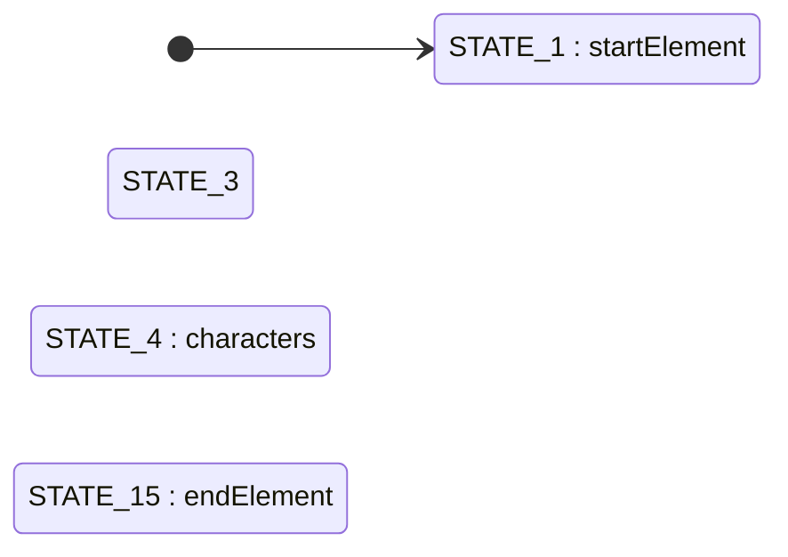

# State Machine & Dispatch Table Extraction

Extract command dispatchers, switch/case dispatch tables, and state machines from decompiled Windows PE binaries. Maps case values to handler functions and generates Mermaid/DOT state diagrams.

## Quick Start

```bash
# 1. Find the module DB
python .agent/skills/decompiled-code-extractor/scripts/find_module_db.py cmd.exe

# 2. Scan module for dispatchers and state machines
python .agent/skills/state-machine-extractor/scripts/detect_dispatchers.py extracted_dbs/cmd_exe_6d109a3a00.db

# 3. Extract dispatch table for a specific function
python .agent/skills/state-machine-extractor/scripts/extract_dispatch_table.py extracted_dbs/cmd_exe_6d109a3a00.db PrintPrompt

# 4. Reconstruct state machine
python .agent/skills/state-machine-extractor/scripts/extract_state_machine.py extracted_dbs/cmd_exe_6d109a3a00.db Dispatch

# 5. Generate diagram
python .agent/skills/state-machine-extractor/scripts/generate_state_diagram.py extracted_dbs/cmd_exe_6d109a3a00.db --function Dispatch
```

## What It Does

Detects three dispatch patterns in decompiled code and reconstructs structured tables from them:

| Pattern | Detection Method | Example |
| ------- | ---------------- | ------- |
| **switch/case** | Regex parsing of `switch(var) { case N: ... }` | cmd.exe `Dispatch`, `PrintPrompt` |
| **if-else chains** | Repeated `if (var == CONST)` on same variable (4+ branches) | `GetRegistryValues`, `ParseDirParms` |
| **jump tables** | `outbound_xrefs` with `is_jump_table_target: true` | Compiler-optimized large switches |

When dispatch logic appears inside a loop, the function is flagged as a **state machine candidate** and the tool reconstructs states, transitions, initial/terminal states, and loop characteristics.

## Scripts

### detect_dispatchers.py -- Module Scan (Start Here)

Scans every function in a module and ranks dispatch candidates by case count.

```bash
# Full scan (default min 3 cases)
python .agent/skills/state-machine-extractor/scripts/detect_dispatchers.py <db_path>

# Require at least 5 cases
python .agent/skills/state-machine-extractor/scripts/detect_dispatchers.py <db_path> --min-cases 5

# Only state machine candidates (dispatch inside loops)
python .agent/skills/state-machine-extractor/scripts/detect_dispatchers.py <db_path> --with-loops

# JSON output
python .agent/skills/state-machine-extractor/scripts/detect_dispatchers.py <db_path> --json
```

### extract_dispatch_table.py -- Case-to-Handler Mapping

Extracts the full dispatch table from a specific function.

```bash
# By function name
python .agent/skills/state-machine-extractor/scripts/extract_dispatch_table.py <db_path> PrintPrompt

# By function ID
python .agent/skills/state-machine-extractor/scripts/extract_dispatch_table.py <db_path> --id 197

# Search for functions
python .agent/skills/state-machine-extractor/scripts/extract_dispatch_table.py <db_path> --search "Dispatch"

# JSON output
python .agent/skills/state-machine-extractor/scripts/extract_dispatch_table.py <db_path> PrintPrompt --json
```

### extract_state_machine.py -- State Machine Reconstruction

Reconstructs states, transitions, and loop info from dispatch-in-loop functions.

```bash
# By function name
python .agent/skills/state-machine-extractor/scripts/extract_state_machine.py <db_path> Dispatch

# By function ID
python .agent/skills/state-machine-extractor/scripts/extract_state_machine.py <db_path> --id 97

# Include decompiled code
python .agent/skills/state-machine-extractor/scripts/extract_state_machine.py <db_path> Dispatch --with-code

# JSON output
python .agent/skills/state-machine-extractor/scripts/extract_state_machine.py <db_path> Dispatch --json
```

### generate_state_diagram.py -- Mermaid/DOT Diagrams

Generate visual diagrams for dispatch tables or state machines.

```bash
# Auto-detect mode (state machine if loops, dispatch otherwise)
python .agent/skills/state-machine-extractor/scripts/generate_state_diagram.py <db_path> --function <name>

# Force dispatch table diagram
python .agent/skills/state-machine-extractor/scripts/generate_state_diagram.py <db_path> --function <name> --mode dispatch

# Force state machine diagram
python .agent/skills/state-machine-extractor/scripts/generate_state_diagram.py <db_path> --function <name> --mode state-machine

# DOT format (for Graphviz)
python .agent/skills/state-machine-extractor/scripts/generate_state_diagram.py <db_path> --function <name> --format dot

# By function ID
python .agent/skills/state-machine-extractor/scripts/generate_state_diagram.py <db_path> --id 97
```

## Example Output

```
================================================================================
  STATE MACHINE CANDIDATES (14 found)
  Functions with dispatch logic inside loops
================================================================================

    ID  Cases  Type            Loops   JT  Function Name
------  -----  --------------  -----  ---  --------------------------------------------------
    25     24  loop_switch         3    -  ParseDirParms
    97     15  loop_switch         2    -  Dispatch
   197      9  loop_switch         5    -  PrintPrompt
   201      5  loop_switch         3    -  DisplayStatement
   303      3  loop_switch         1    -  ECWork
```

```
  DISPATCH TABLE: PrintPrompt  switch(v12)  [9 cases + default]

        Case  Handler                                       ID  Int
  ----------  ----------------------------------------  ------  ---
           1  PrintTime                                    220    Y
           2  PrintDate                                    222    Y
           3  StringCchPrintfW                             141    Y
           4  GetVersionString                              37    Y
           5  StringCchCopyW                                57    Y
           8  StringCchPrintfW                             141    Y
          10  IsQueryFullProcessImageNameWStubPresent      466    Y

  Handlers found:  8 (88%)
```



## Files

```
state-machine-extractor/
├── SKILL.md                        # Agent skill instructions (read by Cursor)
├── reference.md                    # Technical reference (algorithms, patterns, data formats)
├── README.md                       # This file
└── scripts/
    ├── _common.py                  # Shared: regex patterns, data structures, JSON helpers
    ├── detect_dispatchers.py       # Module-wide scan for dispatch/state-machine functions
    ├── extract_dispatch_table.py   # Single-function case->handler extraction
    ├── extract_state_machine.py    # State machine reconstruction (states, transitions, loops)
    └── generate_state_diagram.py   # Mermaid and DOT diagram generation
```

## Dependencies

- Python 3.10+
- `.agent/helpers/` module (workspace root) -- provides `open_individual_analysis_db`, `open_analyzed_files_db`
- SQLite analysis databases from DeepExtractIDA

## Related Skills

- [callgraph-tracer](../callgraph-tracer/SKILL.md) -- Trace handler implementations across module boundaries
- [code-lifting](../code-lifting/SKILL.md) -- Lift handler functions into clean, readable source
- [analyze-ida-decompiled](../analyze-ida-decompiled/SKILL.md) -- Navigate and understand decompiled code
- [classify-functions](../classify-functions/SKILL.md) -- Classify all functions by purpose
- [reconstruct-types](../reconstruct-types/SKILL.md) -- Reconstruct struct/class definitions used in handlers
